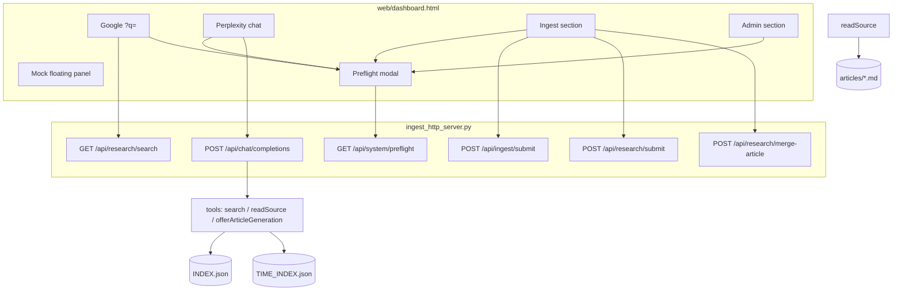

# PRD — Dashboard unificata lab (librarAIn)

> Interfaccia operatore **lab** (non prodotto finale) per esplorare dinamiche end-to-end:
> ricerca consumer, ingest, curatela biblioteca, gate risorse GPU e mock scenari.
> Esito della sessione `/grill-me` (2026-06-26). Complementa [`PRD-Fase1.md`](PRD-Fase1.md) e
> [`PRD_research.md`](PRD_research.md); non sostituisce le UI legacy finché indicato in §2.4.

## 0. Contesto

| Elemento | Stato / decisione |
|---|---|
| Entrypoint nuovo | `GET /dashboard` → `web/dashboard.html` |
| Legacy conviventi | `index.html`, `admin.html`, `ricerca.html` (rimozione post-validazione lab) |
| Articoli pubblicati | `GET /articolo/{poh_id}.html` (esistente, `article_catalog.py`) |
| Backend | Ibrido: API reale + mock (tendina flottante omnipresente) |
| Persistenza chat Perplexity | **No** (v1 lab): storico solo client (`sessionStorage`/memoria) |
| Provider LLM | OpenAI-compatible locale (`RESEARCH_MODEL` e variabili esistenti in `example.env`) |

---

## 1. Executive Summary

### Problem Statement

Le capability operatore (ingest, ricerca catalogo, generazione articoli, curatela POH, repair) sono
sparse su più HTML (`index.html`, `admin.html`, `ricerca.html`) senza un flusso unificato né visibilità
proattiva sulle risorse GPU locali. Serve un **laboratorio** per validare UX ricerca (Google vs
Perplexity), passaggi Ricerca→Ingest e generazione/merge articoli prima del prodotto finale.

### Proposed Solution

Dashboard a **sezioni espandibili** su `/dashboard` con: (1) Ricerca Google (`?q=`) e Perplexity
(chat completions OpenAI con tool); (2) Ingest con nota contesto e generazione/merge articoli;
(3) Admin (repair, audit, VRAM, verifica/merge POH, genera mancanti); (4) **gate modale** preflight
server-side prima di ogni azione GPU; (5) pannello mock flottante con 10 fixture.

### Success Criteria

1. Un operatore completa il flusso **Google vuoto → CTA ingest → upload → genera articoli** senza
   uscire da `/dashboard`, con nota contesto popolata automaticamente.
2. Una query Perplexity con streaming reale invoca almeno un tool call (`search` / `readSource`) e
   renderizza citazioni cliccabili verso `/articolo/{poh_id}.html` entro **30 s p95** su endpoint
   locale raggiungibile (escluso cold-start modello).
3. Il gate preflight blocca il 100% dei submit quando VRAM/modello non conformi (test automatizzato
   con mock GPU + fixture `preflight-blocked`).
4. Rigenerazione merge (`POST /api/research/merge-article`) produce articolo aggiornato incorporando
   materiale del nuovo libro; latenza **≤ 70%** del tempo di `run_research` full su stesso POH
   (misurato su 3 casi gold interni).
5. Tutte e **10** le fixture mock sono selezionabili dalla tendina e producono UI coerente senza
   pipeline reale.

---

## 2. User Experience & Functionality

### 2.1 Personas

- **Curatore/sviluppatore (primario)**: configura biblioteca, debug pipeline, valida mock e preflight.
- **Operatore articoli (cerchia ristretta)**: cerca (Google/Perplexity), genera articoli, fornisce
  fonti via ingest quando manca materiale.

### 2.2 User Stories & Acceptance Criteria

#### US-D1 — Ricerca Google

**Story**: Come operatore, voglio cercare negli articoli stile Google così da trovare rapidamente un
POH/articolo esistente.

**AC**:
- Barra ricerca in sezione Ricerca (modalità Google attiva); submit imposta `?q=` su `/dashboard`
  e renderizza risultati sulla stessa pagina entro **500 ms** (catalogo ≤ 500 articoli, mock escluso).
- Ogni risultato linka `/articolo/{poh_id}.html`; POH senza articolo mostra componente **POH card**
  con pulsante *Genera articolo* (preflight `research` obbligatorio).
- Dopo l’ultimo risultato, CTA: *«Non hai trovato quello che cerchi? Fornisci una fonte per
  generare nuovi articoli»* → chiude Ricerca, espande Ingest, popola **nota contesto** con la query.

#### US-D2 — Ricerca Perplexity

**Story**: Come operatore, voglio porre domande in linguaggio naturale con risposta stream e
citazioni così da esplorare la biblioteca stile Perplexity.

**AC**:
- UI chat nella sezione Ricerca; storico multi-turn **solo client** (refresh tab = perso).
- Preflight `research` **solo al primo messaggio** della conversazione corrente.
- Risposta via `POST /api/chat/completions` (OpenAI-compatible, `stream: true`).
- Citazioni linkano `/articolo/{poh_id}.html`.
- CTA ingest con nota template: query iniziale + elenco POH citati con libri.
- Tool `offerArticleGeneration(poh)` fa comparire pulsante genera in chat (analogo a Google).

#### US-D3 — Ingest e articoli del libro

**Story**: Come curatore, voglio ingestire un PDF e decidere se generare/aggiornare articoli del
libro con gestione sovrapposizioni POH.

**AC**:
- Checkbox *Genera articoli dopo ingest* — **default disattivato**.
- Nota contesto (distinta da note ingest esistenti) sopra i campi, copiabile con pulsante dedicato.
- A ingest completato + checkbox attivo: per ogni POH del libro, check similarità (fuzzy
  label/aliases, soglia `MATCHER_SIMILARITY_THRESHOLD`) con fallback match `poh_id` esatto.
- Sovrapposizione con articolo esistente: **notifica + scelta per POH** (*Nuovo articolo* |
  *Unisci a {poh_esistente}*).
- *Unisci* → merge POH (API esistente) + `POST /api/research/merge-article` con contesto completo
  (pagine POH, metadati REICAT, note operatore).
- Ogni azione GPU passa da preflight (`ingest`, `research`, `research-merge`).

#### US-D4 — Admin biblioteca

**Story**: Come curatore, voglio verificare integrità POH e manutenere pagine/audit/VRAM.

**AC**:
- Sottosezioni: Repair pagine, Audit, Stato VRAM, Verifica POH, Genera articoli mancanti.
- Verifica POH (**modalità C**): gruppi fuzzy automatici + merge manuale target/sources; preview
  label/libri/time_range; conferma esplicita prima del merge.
- Genera singolo articolo da POH card ovunque (Google, Perplexity, Admin) con preflight `research`.

#### US-D5 — Gate risorse GPU

**Story**: Come operatore su hardware limitato, voglio essere bloccato proattivamente se VRAM o
modello caricato non sono adeguati all’operazione.

**AC**:
- Prima di ogni azione pesante: `GET /api/system/preflight?operation={op}`.
- Regola: VRAM libera per caricare il **primo modello** dell’operazione **oppure** modello già
  caricato oltre soglia env per scheda (`GPU_VRAM_MAX_USED_GB`, logica allineata a `gpu_vram.py`).
- Fail → overlay modale full-page (sfondo scuro), interazione bloccata, unico pulsante *Ricontrolla
  risorse* finché `ok: true`.
- Operazioni distinte per log/mock; stesso env model per `research` e `research-merge`
  (`RESEARCH_MODEL`).

#### US-D6 — Mock lab

**Story**: Come sviluppatore, voglio simulare scenari rari senza attendere pipeline complete.

**AC**:
- Tendina flottante espandibile su `/dashboard`; toggle modalità demo + selezione fixture.
- `/articolo/…`: mock sì (fixture articoli), preflight no.
- Fixture obbligatorie (10): vedi §5.1.

### 2.3 Non-Goals (v1 lab)

- Persistenza server conversazioni Perplexity (`data/conversations/`, route `/chat/{id}`).
- Sostituzione o rimozione pagine legacy (`index.html`, `admin.html`, `ricerca.html`).
- Prodotto consumer finale / auth multi-tenant oltre `INGEST_API_TOKEN` esistente.
- Redirect automatico `/` → `/dashboard` ( `/` resta `index.html` ).
- FastAPI / migrazione server HTTP (rimane `ThreadingHTTPServer`).

### 2.4 Layout dashboard

```
/dashboard (?q= opzionale)
├── [Header] stato VRAM / modelli LM Studio / job attivi (read-only)
├── ▼ Ricerca (default: espansa)
│   ├── Toggle: Google | Perplexity
│   ├── Google: barra + risultati inline + CTA ingest
│   └── Perplexity: chat stream + citazioni + CTA ingest + tool generate
├── ▶ Ingestione
│   ├── Nota contesto (copiabile)
│   ├── Form ingest (allineato a index.html)
│   └── Post-ingest: POH overlap UI + genera/merge
├── ▶ Amministrazione
│   ├── Repair · Audit · VRAM · Verifica POH · Genera mancanti
└── [Floating] Mock lab (omnipresente su dashboard)
```

---

## 3. AI System Requirements

### 3.1 Chat completions (`POST /api/chat/completions`)

- **Spec**: OpenAI Chat Completions (stateless); campi `model`, `messages`, `stream`, `tools`,
  `tool_choice`; nessun `conversation_id` nel body.
- **Modello**: `RESEARCH_MODEL` (env).
- **Streaming**: SSE chunk OpenAI-compatible; UI aggiorna testo incrementalmente.

### 3.2 Tool definitions

| Tool | Parametri | Ritorno |
|---|---|---|
| `search` | `query: string`, `n: int` | Lista POH da `INDEX.json` (tutti, non solo con articolo): `poh_id`, `label`, `books[]`, `time_range` (lookup `TIME_INDEX.json`, nullable) |
| `readSource` | `poh: string` | Markdown grezzo da `data/research/articles/{poh}.md`; se assente: `{ok: false, reason: "no_article", poh_id, label}` + hint per invocare tool generazione |
| `offerArticleGeneration` | `poh: string` | Metadati POH; **UI** renderizza pulsante *Genera articolo* (preflight + `POST /api/research/submit` o generazione POH dedicata) |

Implementazione `search`: estendere logica catalogo/subject lookup; non limitare a `search_articles`
(solo pubblicati) — includere POH INDEX senza articolo.

### 3.3 Merge article (`POST /api/research/merge-article`)

- **Input**: `target_poh_id`, materiale nuovo libro (pagine POH, REICAT, note), articolo esistente
  (markdown completo).
- **Prompt**: integrare senza ripetizione verbatim; output nuovo markdown → `publish_poh_article`.
- **Preflight**: operazione `research-merge` (stesso modello env di `research`).

### 3.4 Evaluation Strategy (lab)

- **Mock**: ogni fixture ha test HTTP/UI smoke (server mock + assert DOM/status).
- **Perplexity**: 5 domande gold → almeno 1 tool call per risposta; citazioni `poh_id` risolvono a
  file `.md` o fixture.
- **Preflight**: test unitari su matrice operazione→modello; integrazione con snapshot GPU mock
  (`tests/test_ocr_engine.py` pattern).
- **Merge-article**: 2 casi gold (un POH, due libri) — articolo output contiene riferimenti al
  nuovo libro e non duplica >40% frasi consecutive dell’originale (euristica line-based).

---

## 4. Technical Specifications

### 4.1 Architecture Overview



### 4.2 Integration Points

| Endpoint | Metodo | Auth | Note |
|---|---|---|---|
| `/dashboard` | GET | opzionale token | serve `web/dashboard.html` |
| `/api/system/preflight` | GET | token se configurato | query `operation` |
| `/api/chat/completions` | POST | token | OpenAI-compatible SSE |
| `/api/research/search` | GET | token | esteso per POH senza articolo + metadati |
| `/api/research/submit` | POST | token | generazione singola POH |
| `/api/research/merge-article` | POST | token | **nuovo** |
| `/api/research/generate` | POST | token | batch mancanti (esistente) |
| `/api/admin/subjects` / `merge` | GET/POST | token | esistente |
| `/api/ingest/submit` | POST | token | esistente |
| `/articolo/{poh_id}.html` | GET | no | esistente |

**Preflight operations** (enum iniziale): `ingest`, `research`, `research-merge`, `repair`,
`repair-all`, `chat` (alias modello `research`).

### 4.3 Mock infrastructure

- Header `X-Mock-Scenario` o query `?mock=` + toggle demo in UI (persistenza `sessionStorage`).
- Riuso pattern `web/mockup/server.py` / `client-mock.js` adattato per dashboard.
- Fixture elencate in §5.1.

### 4.4 Security & Privacy

- Stesso modello auth di ingest (`INGEST_API_TOKEN`, header `X-API-Token`).
- Chat completions stateless: nessun log persistente messaggi utente oltre log applicativi esistenti
  (`Log()` con redazione query opzionale — **TBD** redazione PII in v1.1).
- Mock disabilitato se env produzione — **TBD** flag `LAB_MOCK_ENABLED` default `true` in dev.

---

## 5. Risks & Roadmap

### 5.1 Backlog — task atomiche

Ordine consigliato: **D-T1 → D-T2 → D-T3** (infrastruttura) → sezioni UI in parallelo → mock → test.

#### Fase A — Infrastruttura server

- [ ] **D-T1** — `GET /api/system/preflight`: enum operazioni, integrazione `gpu_vram.py` +
  `lmstudio_models.py` (primo modello per op); risposta `{ok, message, vram[], loaded_models[],
  required_model}`; test `tests/test_system_preflight.py`.
- [ ] **D-T2** — Registrare route `GET /dashboard` in `ingest_http_server.py`; servire
  `web/dashboard.html` (shell minima).
- [ ] **D-T3** — Componente JS gate modale: chiama preflight, overlay bloccante, retry; API wrapper
  `preflightOrBlock(operation)`.

#### Fase B — Shell dashboard

- [ ] **D-T4** — Layout sezioni espandibili (Ricerca/Ingest/Admin) + header stato VRAM/modelli/job.
- [ ] **D-T5** — Toggle Ricerca: Google | Perplexity; Ricerca espansa by default.
- [ ] **D-T6** — Transizione sezione: chiudi Ricerca + apri Ingest con scroll/focus; nota contesto
  copiabile (campo dedicato sopra form ingest).

#### Fase C — Ricerca Google

- [ ] **D-T7** — Sync barra ricerca ↔ `?q=`; reload risultati su navigazione history.
- [ ] **D-T8** — Render risultati via `GET /api/research/search` (esteso §4.2); link
  `/articolo/{poh_id}.html`.
- [ ] **D-T9** — Componente **POH card** riusabile (stati: published / missing / overlap); pulsante
  genera + preflight `research`.
- [ ] **D-T10** — CTA post-risultati → ingest + nota query.

#### Fase D — Ricerca Perplexity (AI)

- [ ] **D-T11** — `POST /api/chat/completions`: proxy OpenAI-compatible, `stream: true`, modello
  `RESEARCH_MODEL`.
- [ ] **D-T12** — Implementare tool `search` (INDEX + TIME_INDEX + libri).
- [ ] **D-T13** — Implementare tool `readSource` (markdown; risposta no_article strutturata).
- [ ] **D-T14** — Implementare tool `offerArticleGeneration` + rendering pulsante in UI chat.
- [ ] **D-T15** — UI chat: stream parser, citazioni → `/articolo/`, storico client-only;
  preflight solo primo messaggio.
- [ ] **D-T16** — CTA Perplexity → ingest; nota template query + POH/libri citati.

#### Fase E — Ingest & articoli

- [ ] **D-T17** — Portare form ingest da `index.html` in sezione Ingest (SSE/status invariati).
- [ ] **D-T18** — Checkbox genera articoli (default off); post-ingest lista POH libro.
- [ ] **D-T19** — Rilevamento similarità POH (fuzzy + fallback id); UI scelta Nuovo/Unisci per
  sovrapposizioni + notifiche non bloccanti.
- [ ] **D-T20** — `POST /api/research/merge-article`: prompt merge efficiente + publish; preflight
  `research-merge`; test `tests/test_research_merge_article.py`.

#### Fase F — Admin

- [ ] **D-T21** — Migrare in dashboard: repair pagine (SSE), audit, pannello VRAM.
- [ ] **D-T22** — Verifica POH: lista fuzzy + merge manuale + preview/conferma (API subjects esistenti).
- [ ] **D-T23** — Genera articoli mancanti (batch) con preflight e progress UI.

#### Fase G — Mock lab (10 fixture)

- [ ] **D-T24** — Tendina flottante mock: toggle demo + selector scenario; hook fetch/SSE.
- [ ] **D-T25** — Fixture `ricerca-google-hit`.
- [ ] **D-T26** — Fixture `ricerca-google-empty`.
- [ ] **D-T27** — Fixture `ricerca-perplexity-stream`.
- [ ] **D-T28** — Fixture `preflight-blocked`.
- [ ] **D-T29** — Fixture `preflight-ok`.
- [ ] **D-T30** — Fixture `ingest-sse-progress`.
- [ ] **D-T31** — Fixture `ingest-done-poh-list`.
- [ ] **D-T32** — Fixture `genera-articoli-skip-simile` (overlap/simile).
- [ ] **D-T33** — Fixture `admin-poh-duplicati`.
- [ ] **D-T34** — Fixture `admin-repair-sse`.
- [ ] **D-T35** — Mock parziale su `/articolo/…` (articoli simulati, no preflight).

#### Fase H — Test & doc

- [ ] **D-T36** — Test integrazione dashboard: preflight block → retry pass (mock GPU).
- [ ] **D-T37** — Test smoke Google `?q=` + link articolo.
- [ ] **D-T38** — Test smoke chat stream + tool call (mock LLM).
- [ ] **D-T39** — Aggiornare README con `/dashboard`, preflight, mock lab.

### 5.2 Phased Rollout

| Fase | Scope | Gate uscita |
|---|---|---|
| **MVP lab** | D-T1–D-T16, D-T24–D-T29, D-T35 | Google + Perplexity + mock + preflight funzionanti |
| **v1 lab** | D-T17–D-T23, D-T30–D-T34 | Ingest/Admin integrati + merge-article |
| **v1.1** | Persistenza chat, redazione log, `LAB_MOCK_ENABLED` | Decisione post-feedback cerchia |
| **v2** | Deprecazione legacy HTML, `/` → dashboard | Parità funzionale verificata |

### 5.3 Technical Risks

| ID | Rischio | Mitigazione |
|---|---|---|
| R-D1 | Tool calling non supportato bene dal modello locale | Fallback UI: risultati `search` mostrati anche senza tool; eval 5 query gold |
| R-D2 | Preflight diverge da check pipeline ingest | Riusare `require_gpu_vram` / `_find_loaded_instance_ids`; test parità |
| R-D3 | `dashboard.html` > 500 LOC | Split JS in `web/dashboard/` (shell + moduli) entro D-T4 |
| R-D4 | Merge-article allucina o duplica | Prompt vincolante + euristica eval §3.4; curatore conferma preview |
| R-D5 | Mock intercept fragile con fetch nativo | Un solo `apiFetch` wrapper; test per scenario header |

---

## 6. Open Questions (TBD)

1. Flag env `LAB_MOCK_ENABLED` — default e comportamento se assente?
2. Redazione query utente nei log chat completions?
3. Propagazione merge POH a `INDEX.md` per-libro o solo `INDEX.json` aggregato? (eredita AUDIT M2.4)

---

## Changelog

| Data | Nota |
|---|---|
| 2026-06-26 | Creazione PRD post `/grill-me`; backlog D-T1…D-T39 |
