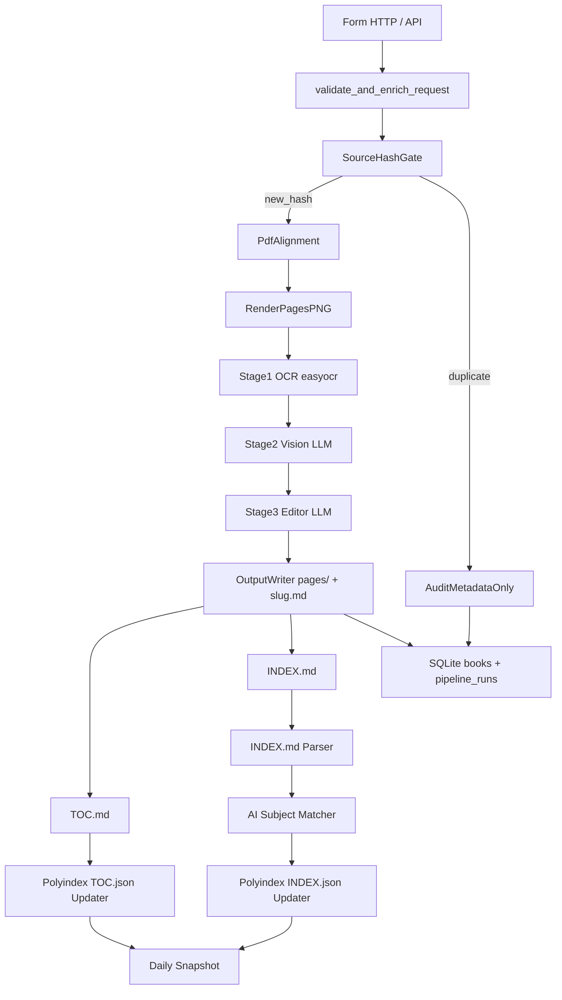
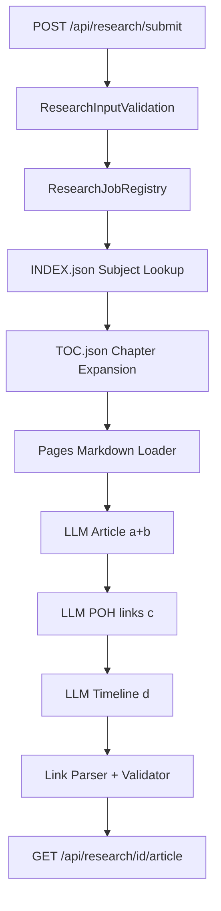

# PRD — librarAIn (Fasi 1 Ingestione e 2 Ricerca)

> Documento unico di prodotto. Sostituisce la precedente versione limitata alla sola Fase 1.
> Allineato al manoscritto in `trascrizione-fogli-manoscritti.md` e alla struttura repo in `README.md`.
> **Ultimo allineamento codebase**: 2026-06-11 (stato task in §5.1 e §7).
> **Fase 2 — Ricerca**: le sezioni Fase 2 di questo documento (§2.3, §2.5, §4.2, §7 F2-T*) sono
> superate da [`PRD_research.md`](PRD_research.md), che è il riferimento normativo aggiornato ed
> espanso per la Ricerca. Qui restano per contesto storico e tracciabilità del backlog.

## 0. Assunzioni di scoping (da confermare in PR review)

Queste assunzioni sono frutto di discovery non completata. Vanno confermate o ribaltate prima di chiudere l'MVP. Sono evidenziate qui in apertura per essere trovate subito.

- **A1 — Definizione di POH**: entità generica del dominio (persona, luogo, evento o concetto storico), con `time_range` opzionale, `id` stabile e `aliases[]`. Non si forza una tassonomia rigida in MVP.
- **A2 — Search MVP**: in MVP la Fase 2 implementa **tutti** i passi del manoscritto: `a` articolo, `b` citazioni alle fonti, `c` hyperlink agli altri POH menzionati, `d` vertical time bar (in file Markdown = sezione cronologica strutturata; il renderer UI può poi mapparla su una barra laterale). Dettaglio formattazione in §2.5.1.
- **A3 — Stack ricerca**: nessun Milvus, nessun RAG vettoriale dedicato. La ricerca usa **polyindex** (`TOC.json` + `INDEX.json`) + LLM per generazione articolo. Eventuali embeddings sono interni al subject matcher di `INDEX.json`, non un secondo backbone di retrieval.
- **A4 — AI Subject Matcher**: pipeline 2-stadi: normalizzazione deterministica (lowercase, accenti, lemmatizzazione minimale) → AI matching (embeddings + LLM dirimitore) solo sui residui ambigui.
- **A5 — Checkpoints**: snapshot giornaliero schedulato + on-demand; retention configurabile (default 30 giorni).
- **A6 — UI**: in MVP solo pagina HTML singola per l'upload operatore. UI di ricerca (`web/search.html`) è v1.1.
- **A7 — Filename DB**: `data/db/biblioteca.csv` — **file binario SQLite**; l’estensione `.csv` è convenzione di naming del prodotto, **non** un export tabulare. Snapshot in `data/db/checkpoints/biblioteca.YYYY-MM-DD.csv` (stessa natura). Codice e path canonico: vedere `Settings.sqlite_path`.
- **A8 — Provider AI**: unico modello configurabile via `.env` (OpenAI-compatible) per Vision, Editor, Subject Matcher e Research; ogni stage può avere model id override.

## 1. Executive Summary

- **Problem Statement**: oggi i libri scansionati non si trasformano in conoscenza interrogabile in modo coerente: l'ingestione è parziale, la catalogazione bibliografica vive separata dal contenuto, e non esiste una "biblioteca semantica" navigabile cross-book.
- **Proposed Solution**: pipeline end-to-end deterministica che (1) ingesce PDF + REICAT in pagine Markdown allineate, (2) costruisce per ogni libro `TOC.md`/`INDEX.md`/`<NomeLibro>.md`, (3) aggrega cross-book in `polyindex/TOC.json` e `polyindex/INDEX.json` con riconciliazione AI dei soggetti, (4) espone una API di **Ricerca** che, data una query (eventualmente collegata a un POH), produce un **unico file Markdown** in stile Wikipedia con citazioni come link MD alle fonti (passi `a`–`b`), hyperlink agli altri POH in sintassi CommonMark (passo `c`) e sezione `## Cronologia` tabellare verticale per la linea temporale (passo `d`).
- **Success Criteria (cross-fase)**:
  - 100% dei libri ingestiti produce: cartella `data/output/<sha256>/` con `pages/`, `<slug>.md`, `TOC.md`, `INDEX.md`, `manifest.json`.
  - 100% delle ingestioni con esito `succeeded` aggiorna `polyindex/TOC.json` e `polyindex/INDEX.json` in modo idempotente (riesecuzione → zero duplicati). *Stato codebase*: `TOC.json` (T23) e `INDEX.json` (T26) implementati; anche `TIME_INDEX.json` (estensione post-PRD, cablato in orchestrator).
  - Per la ricerca: ≥80% di una gold set di 20 query produce un **Markdown** che soddisfa **tutti** i passi a–d (articolo, link fonti, link POH, sezione Cronologia); almeno 1 fonte valida per articolo; precisione citazioni (pagine esistenti) ≥95%; ogni link `poh:` punta a un `poh_id` noto nel registro POH o è marcato esplicitamente come `poh:unknown-<slug>` con TODO in coda documento.
  - Tempo medio end-to-end Upload (PDF 200 pagine, 1 vCPU + endpoint AI raggiungibile) < 30 min con `MAX_PARALLEL_REQUEST=4`.
  - 100% delle esecuzioni produce una riga in `pipeline_runs` con stato finale e contatori.
  - 0 chiavi API stampate nei log; 0 file `.env` committati.

## 2. User Experience & Functionality

### 2.1 Personas

- **Operatore di ingestione**: bibliotecario/operatore che carica un PDF e compila REICAT. Vuole un singolo punto di input, errori chiari, idempotenza.
- **Storico/Ricercatore**: utente finale che pone domande di dominio (eventualmente legate a un POH) e si aspetta un articolo coerente con citazioni puntuali.
- **Pipeline Orchestrator**: servizio automatico che esegue Upload e Ricerca senza intervento umano (per batch e test).

### 2.2 User Stories — Fase 1 Upload

- Come operatore, voglio caricare PDF + REICAT + range TOC/INDEX in un unico form HTTP, così da avviare l'ingestione senza più canali sincronizzati a mano.
- Come orchestratore, voglio che lo stesso PDF (stesso `sha256`) non venga rielaborato OCR/LLM, così da evitare costi e tempi inutili.
- Come orchestratore, voglio che ogni stage (OCR, Vision, Editor) sia idempotente per pagina, così da poter riprendere senza ripartire da zero.
- Come sistema biblioteca, voglio che ogni libro processato aggiorni `polyindex/TOC.json` e `polyindex/INDEX.json` in modo atomico, così da mantenere coerenza cross-book.
- Come team, voglio snapshot giornalieri di `biblioteca.csv` e `polyindex/*.json`, così da poter rollback a uno stato noto.

### 2.3 User Stories — Fase 2 Ricerca

- Come ricercatore, voglio inviare una query in linguaggio naturale (con riferimento opzionale a un POH), così da ricevere un articolo che sintetizzi le informazioni rilevanti tratte dai libri indicizzati.
- Come ricercatore, voglio che ogni affermazione non triviale dell'articolo riporti una citazione verificabile tramite **link Markdown** `source:` verso la pagina libro, così da aprire la fonte senza HTML.
- Come sistema, voglio individuare deterministicamente i capitoli e le pagine candidate via `polyindex/INDEX.json` (lookup per soggetto) e `polyindex/TOC.json` (struttura capitoli), così da limitare il contesto del LLM e ridurre allucinazioni.
- Come orchestratore, voglio che la ricerca sia asincrona (job model identico all'ingest), così da gestire query lunghe senza bloccare il client.
- Come ricercatore, voglio che i POH menzionati nel testo diversi dal soggetto principale siano **hyperlink in Markdown**, così da navigare verso altri articoli o risolvere da tooling.
- Come ricercatore, voglio una **cronologia verticale** (linea temporale) nel documento, così da vedere subito l’ordine degli eventi citati.

### 2.4 Acceptance Criteria — Fase 1 Upload

Conservati e raffinati rispetto alla versione precedente del PRD; di seguito solo le **modifiche/aggiunte sostanziali** rispetto al passato.

- Output per libro includono ora anche `<slug>.md` (Σ pages, concatenazione ordinata di `pages/p.NNNN.<slug>.md` con separatore `\n\n---\n\n`).
- `polyindex/TOC.json` aggiornato al completamento di ogni ingest (**implementato**, T23): scrittura atomica + lock file (Unix: `fcntl`; Windows: lock ancora da completare). Struttura su disco:
  ```json
  {
    "schema_version": "1.0",
    "books": {
      "<source_sha256>": {
        "title": "...",
        "slug": "...",
        "chapters": [
          {"label": "Capitolo I", "aligned_page_start": 12, "aligned_page_end": 34, "original_page_start": 14, "original_page_end": 36}
        ]
      }
    }
  }
  ```
  Cablato in `orchestrator.run_pipeline` via `sync_polyindex_toc_from_book` (`src/ingestion/polyindex/toc_json.py`).
- `polyindex/INDEX.json` aggiornato con struttura (**implementato**, T26):
  ```json
  {
    "<canonical_subject_id>": {
      "canonical_label": "Marco Polo",
      "aliases": ["M. Polo", "Polo, Marco"],
      "books": {
        "<source_sha256>": {"aligned_pages": [12, 18, 22], "original_pages": [14, 20, 24]}
      }
    }
  }
  ```
- Aggiornamento di `polyindex/*.json` è **atomico**: scrittura su file temporaneo + `os.replace`; lettura→merge→scrittura protetta da lock (file lock; su Windows il lock TOC è ancora no-op — vedi `toc_json._toc_file_lock`).
- AI subject matcher è in MVP: usato in T26 per associare un soggetto nuovo a un canonical esistente; sempre fallback deterministico se endpoint AI non risponde.
- Snapshot giornaliero (cron interno via APScheduler stdlib-friendly o task asyncio) salva copia di `biblioteca.csv` in `data/db/checkpoints/biblioteca.YYYY-MM-DD.csv` e copie di `polyindex/*.json` in `data/polyindex/checkpoints/YYYY-MM-DD.*.json`. Endpoint `POST /api/admin/checkpoint` per snapshot on-demand.
- Telemetria minima: tabella `pipeline_runs` con `request_id`, `source_sha256`, stato finale, contatori, `pipeline_version`.

### 2.5 Acceptance Criteria — Fase 2 Ricerca (MVP: passi **a, b, c, d** del manoscritto)

> **Superato**: versione aggiornata ed espansa in [`PRD_research.md`](PRD_research.md) §2.3–§2.4
> (include il nuovo Time Lookup su `TIME_INDEX.json` e gli stati limite).

- Endpoint `POST /api/research/submit` accetta body JSON `{query: str, poh?: {id, label, time_range?}, options?: {max_books?, max_pages_per_book?}}`. Ritorna 202 con `{request_id, status: "accepted"}`.
- Endpoint `GET /api/research/{request_id}` ritorna stato job (`accepted|running|succeeded|failed`) + `pipeline_version` + `last_error?` + ultimi N eventi.
- Endpoint `GET /api/research/{request_id}/article` ritorna il prodotto finale: `{markdown, citations: [...], pohs_referenced: [{poh_id, label, linked_from_count}], timeline_rows: [{period, event, source_links[]}]}`. I campi strutturati duplicano ciò che è già nel Markdown per consumo programmatico.
- Pipeline di ricerca deterministica nel pre-filtro:
  1. Lookup in `polyindex/INDEX.json`: estrazione candidati `{libro_sha256: [pagine]}` dai soggetti rilevanti per la query (normalizzazione + AI matching dei soggetti della query con i `canonical_label`/`aliases`).
  2. Espansione capitoli via `polyindex/TOC.json`: per ogni pagina candidata, recupero del capitolo che la contiene; aggiunta delle pagine vicine se il capitolo è < 6 pagine.
  3. Caricamento contenuti: lettura dei `pages/p.NNNN.<slug>.md` corrispondenti da `data/output/<sha>/`.
  4. **Passo `a`–`b`**: generazione bozza articolo (1+ chiamate LLM) con `src/search/prompts/article_prompt.md`: stile Wikipedia; **solo** link Markdown alle fonti (CommonMark), niente `<a href>`.
  5. **Passo `c`**: pass successivo dedicato (`src/search/prompts/poh_links_prompt.md`) **oppure** stesso turno se il prompt unico include istruzioni esplicite: ogni menzione di un POH (identificato da elenco `poh_candidates` derivato da INDEX + query) diventa `[etichetta visibile](poh:<poh_id>)`. Il POH principale della request **non** va linkato a se stesso nel primo paragrafo di lead; ripetizioni successive sì. Regole complete in §2.5.1.
  6. **Passo `d`**: generazione o validazione blocco `## Cronologia` (vedi §2.5.1) con LLM + vincolo strutturale (tabella GFM) e validazione post-hoc (date non inventate senza fonte linkata nella stessa riga).
  7. Post-processing: parsing di tutti i link `(...)` nel Markdown, validazione URL `source:` e `poh:`, allineamento con `citations` JSON.
- L'articolo è prodotto in **italiano**. Output principale = stringa Markdown UTF-8; niente HTML come formato primario (eccezione: entità già presenti nelle fonti restano escaped come nel sorgente).
- Costi predicibili: pre-filtro deterministico produce un budget di contesto bounded (`max_books`, `max_pages_per_book`, default 5 libri × 8 pagine).
- Idempotenza: stessa query + stesso stato polyindex → stesso `request_id` se ripetuta entro 1h (hash query+poh+polyindex_version come dedup key), opzionale via flag.

#### 2.5.1 Formattazione Markdown (fonti, POH, cronologia)

Convenzione **CommonMark** + **GitHub Flavored Markdown** per tabelle. Tutti i link usano la forma `[testo destinazione](URL)` dove `URL` è uno dei seguenti schemi (nessuno spazio non encoded dentro le parentesi).

**B — Link alle fonti (pagine libro)**  
- Forma canonica consigliata per il file su disco e per tooling interno:
  `source:<source_sha256>:aligned:<p>` dove `<p>` è la **pagina allineata** 1-based (coerente con i file `p.NNNN.<slug>.md`).
  Esempio nel Markdown: `[Battaglia di Curzola, pp. 112–114](source:a1b2…f00:aligned:112)`.
- **Descrizione umana** dentro `[]`: titolo breve del fatto + riferimento pagina; ripetere il link a ogni paragrafo che dipende da quella pagina **oppure** usare riferimenti a nota a piè con secondo round di post-processing (v1.1 se non in MVP: in MVP basta link inline ripetuto o frase “Vedi fonti in Cronologia”).
- Il post-processore **deve** risolvere ogni `source:` contro `manifest.json` del libro; link con sha o pagina invalida → rimossi e sostituiti con `*[[fonte non verificabile]]*` + log.

**C — Link ad altri POH**  
- Forma: `[Nome leggibile](poh:<poh_id>)` dove `<poh_id>` è stabile (es. `subj_marco_polo` allineato al `canonical_subject_id` in `INDEX.json`, oppure `poh.uuid…` se generato).  
- Non usare URL `http(s):` verso articoli POH in MVP (non esistono ancora host stabili); lo schema `poh:` è un **placeholder risolvibile** da viewer/CLI (`research open poh:…`).  
- Se l’entità non è nel registro: `[Nome](poh:unknown-<slug-normalizzato>)` e in coda al documento una sezione `## Annotazioni` con bullet `TODO: risolvere poh:unknown-…`.

**D — Vertical time bar come Markdown**  
Nel file, la “barra” è la **lista verticale** ordinata dal più antico al più recente. Obbligo di sezione:

```markdown
## Cronologia

| Periodo | Evento | Fonti |
|---------|--------|-------|
| 1271–1295 | Marco Polo intraprende il viaggio verso la Cina. | [Sintesi dalle fonti](source:…:aligned:…) |
```

Regole:
- Titolo sezione esattamente `## Cronologia` (H2, UTF-8).
- Tabella con **esattamente** tre colonne nell’ordine indicato; intestazioni fisse (`Periodo`, `Evento`, `Fonti`).
- Ogni riga della colonna **Fonti** contiene almeno un link `source:` valido **oppure** `—` se l’evento è solo contesto temporale desunto da una fonte già citata nella riga precedente (massimo 1 riga consecutiva così; altrimenti Ogni evento ha fonte).
- Ordine righe: cronologico crescente (evento più vecchio in alto). Questo ordine verticale è ciò che la UI può proiettare su una time bar laterale senza cambiare il sorgente.
- Vietato Mermaid o HTML per la tabella in MVP (solo pipe table GFM).

### 2.6 Non-Goals

- Nessun Milvus, FAISS o backbone di retrieval vettoriale dedicato (eliminato dalla visione di prodotto).
- Nessuna UI di ricerca avanzata in MVP (solo API).
- Nessuna multi-tenancy.
- Nessuna autenticazione utente (deployment è interno/single-user in MVP).
- Nessuna migrazione di DB diversi da SQLite in MVP.
- Nessun fine-tuning di modelli; usiamo modelli generalisti via endpoint OpenAI-compatible.

## 3. AI System Requirements

### 3.1 Modelli e usi

| Stage | Tipo | Modello (config) | Output atteso |
|---|---|---|---|
| OCR (Stage 1) | OCR locale (no LLM) | `easyocr` | Testo grezzo per pagina |
| Vision refine (Stage 2) | LLM multimodale | `VISION_MODEL` | Markdown fedele alla pagina |
| Editor refine (Stage 3) | LLM testuale | `EDITOR_MODEL` | Markdown normalizzato |
| Subject Matcher | Embeddings + LLM dirimitore | `MATCHER_EMBEDDING_MODEL` + `MATCHER_LLM_MODEL` | `canonical_subject_id` |
| Research Article | LLM testuale (long context utile) | `RESEARCH_MODEL` | Markdown completo (a–d): corpo + link `source:` + link `poh:` + `## Cronologia` |

Tutti i modelli sono raggiungibili via client OpenAI-compatible. Stessa istanza centralizzata in `src/core/openai_client.py` (T12a).

### 3.2 Prompt di sistema (file in repository)

I testi di sistema per gli LLM sono **file Markdown nel repo**; la cronologia delle modifiche è quella di **Git**, non suffissi tipo `v1`/`v2` né variabili d’ambiente `*_PROMPT_VERSION`.

- `src/ingestion/pipeline/prompts/vision_prompt.md` — Stage 2 Vision
- `src/ingestion/pipeline/prompts/editor_prompt.md` — Stage 3 Editor (T13)
- `src/ingestion/polyindex/prompts/subject_matcher_prompt.md` — Subject matcher (T25)
- `src/search/prompts/article_prompt.md` — ricerca: articolo (`a`–`b`)
- `src/search/prompts/poh_links_prompt.md` — ricerca: link POH (`c`); opzionalmente fuso nello stesso turno di `article_prompt.md`
- `src/search/prompts/timeline_prompt.md` — ricerca: sezione `## Cronologia` (`d`)

Mai prompt hardcoded in Python. La cache Stage 2 è legata al modello Vision; dopo modifiche a `prompts/vision_prompt.md` usa `force_recompute` o cancella `stage2Vision/` sotto `tmp` se serve rigenerare tutto.

### 3.3 Evaluation Strategy

- **MVP**: smoke E2E con 1 libro reale ridotto (4–6 pagine) + 5 query mock; verifica passi **a–d**: presenza `## Cronologia` con tabella valida, almeno un `source:` per riga datata, almeno un `poh:` se il testo menziona un secondo soggetto noto in INDEX.
- **v1.1**: gold set di 20 query con expected_books/expected_subjects; metriche: subject recall (matcher), citation precision (research), article informativeness (rating umano 1–5).
- **POI**: benchmark periodico (mensile) sulla gold set + regression test.

### 3.4 Safety/Guardrail

- System prompt vincolante in stile "rispondi solo se sostenuto dalle pagine fornite, altrimenti dichiara l'incertezza".
- `temperature` default 0.1 per Vision/Editor, 0.3 per Research (più libertà narrativa ma stesso vincolo di fonti).
- Mai loggare testo OCR > 200 caratteri, mai loggare chiavi API.

## 4. Technical Specifications

### 4.1 Architettura — Fase 1 Upload



*Nota implementativa (2026-06-11)*: `polyTocUpdater`, `polyIndexUpdater` (`sync_polyindex_index_from_book`), `timeIndexUpdater` (`sync_time_index_from_book_async` → `TIME_INDEX.json`) e `cleanup tmp` (T28, `cleanup_tmp_after_success`) sono cablati in `orchestrator.run_pipeline`; `snapshot` (T27) non è ancora in pipeline.

### 4.2 Architettura — Fase 2 Ricerca



Nota: i tre passi LLM possono essere **fusi** in una o due chiamate se i prompt lo consentono; il diagramma descrive la **responsabilità logica** richiesta in output.

### 4.3 Modello di esecuzione HTTP

**Stato attuale (MVP, uso interno)**: `ThreadingHTTPServer` in `src/api/ingest_http_server.py` — `POST /api/ingest/submit` → 202 con `job_id`, worker in background (`threading` + `run_full_pipeline` in `ingest_pipeline_runner.py`), `GET /api/ingest/{job_id}/status`, SSE `GET /api/ingest/{job_id}/events`. Servizio statico `web/index.html` su `/` e `/index.html`. Upload multipart in RAM fino a `INGEST_MAX_UPLOAD_BYTES`. Registry in-process: `src/api/job_registry.py`. Il worker invoca `orchestrator.run_pipeline` con `_ACTIVE_PAGE_STAGES = 3` (OCR → Vision → Editor), poi writer per libro, `TOC.md`/`INDEX.md`, sync `polyindex/{TOC,INDEX,TIME_INDEX}.json`; il payload JSON di risposta espone `stage1`/`stage2`/`stage3` (non ancora path artefatti finali nel body). Sufficiente per cura/gestione biblioteca a bassa concorrenza.

**Modello target (rimandato — T18.5 + T21b)**: refactor FastAPI/async come sotto; non bloccante per il percorso MVP Upload descritto in §5.1.

- **Upload (target)**: `POST /api/ingest/submit` (multipart **streaming**) → 202 con `request_id`. `GET /api/ingest/{id}` ritorna stato. `GET /api/ingest/{id}/artifacts` elenca file in `data/output/<sha256>/`.
- **Research (target)**: `POST /api/research/submit` (JSON) → 202 con `request_id`. `GET /api/research/{id}` stato. `GET /api/research/{id}/article` prodotto finale.
- **Admin (target)**: `POST /api/admin/checkpoint` → 202; `GET /health`.
- Backend job in-process via asyncio TaskGroup; nessun broker esterno. Job registry separati per `ingest` e `research`, stessa struttura base (`request_id`, `status`, `events`, `pipeline_version`).

### 4.4 Integration Points

- **OCR/LLM**: `src/core/openai_client.py` come unica fabbrica di client (T12a). Endpoint configurato via `.env`.
- **Persistence**: `data/db/biblioteca.csv` (SQLite binario; estensione `.csv` = naming prodotto). Tabelle: `books`, `book_metadata_audit`, `pipeline_runs`, `_schema_migrations`, (future) `research_runs`, `subject_embeddings`. Schema versioning esplicito (PRE-B).
- **Artifacts cross-book**: `data/polyindex/TOC.json`, `data/polyindex/INDEX.json`, con `checkpoints/` giornalieri.
- **Per-book artifacts**: `data/output/<sha256>/{pages/, <slug>.md, TOC.md, INDEX.md, manifest.json}`.

### 4.5 Runtime configuration (`.env` esteso)

Nuove variabili rispetto all'attuale `example.env`:

```
# --- Polyindex / Subject matcher ---
MATCHER_EMBEDDING_MODEL=text-embedding-3-small
MATCHER_LLM_MODEL=gpt-4.1-mini
MATCHER_SIMILARITY_THRESHOLD=0.86
MATCHER_USE_AI=true

# --- Research ---
RESEARCH_MODEL=gpt-4.1-mini
RESEARCH_MAX_BOOKS=5
RESEARCH_MAX_PAGES_PER_BOOK=8
RESEARCH_TEMPERATURE=0.3

# --- Checkpoints ---
CHECKPOINT_DAILY_ENABLED=true
CHECKPOINT_RETENTION_DAYS=30

# Prompt: file .md nel repository (vedi §3.2); nessuna variabile *_PROMPT_VERSION.
```

### 4.6 Security & Privacy

- Chiavi/API key esclusivamente in `.env`, mai loggate, mai stampate.
- Log strutturato opzionale su file giornaliero via `Log(..., to_file=True)` in `src/core/log.py` (JSONL sotto `log_dir`, default `./log`); console resta colorata. Mai loggare chiavi API; testo OCR troncato con `safe_text`.
- Path assoluti contenenti utente di sistema mai esposti via API; sempre relativi a `DATA_ROOT`.
- Tracciabilità per libro: `pipeline_runs.request_id`, `source_sha256`, `pipeline_version`, timestamp.
- Tracciabilità per ricerca: `research_runs.request_id`, hash query, libri/pagine usati come contesto (audit).
- Nessun PII di default (i libri sono pubblicazioni); se in futuro si trattano contenuti personali, va aggiunta sezione GDPR.

### 4.7 Open Questions tecniche

- **OQ1**: thread-safety di scrittura `polyindex/*.json` quando 2 ingest finiscono contemporaneamente → adottato file lock (`fcntl` su Unix) + atomic replace; sufficiente per single-process (server HTTP attuale o futuro FastAPI) ma da rivedere se passiamo a multi-worker (v2.0).
- **OQ2**: dimensione massima di `INDEX.json` prima di sharding (es. per soggetto inizia con A, B, ...) → posticipato a v2.0.
- **OQ3**: cache embeddings dei soggetti canonici → serve persistenza? Probabilmente sì in SQLite (`subject_embeddings`) per evitare rigenerazioni; vedi T24.

### 4.8 Logging (`src/core/log.py`)

Modulo unico di logging: **console colorata** (default) + opzioni audit su file/return JSON.

**Flusso obbligatorio**

1. All’avvio del processo, chiamare **`logInit`** una sola volta (livello globale + cartella log opzionale).
2. Ogni **`Log`** rispetta la gerarchia di livello, salvo **`override=True`**.

**Inizializzazione**

```text
logInit({ERROR|WARNING|INFO|DEBUG|RESULT}_LOG_LEVEL [, log_dir="./log"])
```

- **`log_dir`**: directory per i file giornalieri `{YYYY-MM-DD}.log` (creata on demand). Default `./log`.

**Chiamata**

```text
Log(level, "message" [, params: dict] [, override: bool] [, json: bool] [, to_file: bool]) -> str | None
```

- **`params`**: dizionario opzionale; in console appare in grigio accanto al messaggio. Con context attivo (vedi sotto) include automaticamente `request_id` e `source_sha256`.
- **`override`**: stampa la riga ignorando il filtro globale.
- **`json=True`**: restituisce una stringa JSON con gli stessi campi del record (`ts`, `level`, `file`, `line`, `caller`, `message`, + chiavi da `params`). La console resta **sempre** nel formato colorato attuale.
- **`to_file=True`**: append di una riga JSON (JSONL) su `{log_dir}/{YYYY-MM-DD}.log`. Scrittura thread-safe.

**Context di run (T18b)**

```python
bind_log_context(request_id=..., source_sha256=...)
# ... Log(...) durante la run ...
reset_log_context(request_token, sha_token)
```

- Invocato all’inizio di `run_pipeline`; ogni `Log` nella run eredita `request_id` / `source_sha256` senza ripassarli.
- **`log_stage_block_async(stage_name)`**: log start/end con `duration_ms` (usato sullo stage `pipeline` nell’orchestrator).

**Helper**

- **`safe_text(s, max_len=200)`**: troncamento testo OCR (o altro) nei log.

**Esempi**

```python
from src.core.log import logInit, Log, INFO_LOG_LEVEL, bind_log_context, reset_log_context

logInit(INFO_LOG_LEVEL, log_dir="./log")
Log(INFO_LOG_LEVEL, "pipeline avviata")
Log(INFO_LOG_LEVEL, "dettaglio pagina", {"page": 12}, json=True, to_file=True)
```

**Correlazione audit**: log (console/file) + tabella `pipeline_runs` (T14d) ricostruiscono una run via `request_id`.

## 5. Risks & Roadmap

### 5.1 Phased Rollout

**MVP (sblocca prodotto)**:
- PRE-A–PRE-C (✅): prerequisiti tecnici (parallelismo PDF, migrations SQLite, `pyproject.toml`).
- T1–T10 (✅ già completati).
- **T11 — OCR + ingest Stage 1 (✅ completato)**: T11(a–c) — `OCRPageEngine`/`EasyOCRPageEngine`, renderer PNG (`pypdfium2`), persistenza/cache Stage 1 (`stage1OCR`); **T11.5** — cablaggio HTTP sincrono su `POST /api/ingest/submit` fino a fine Stage 1 (`stage1` in risposta).
- **T12 — Vision Stage 2 (✅ completato)**: T12(a–c) — client OpenAI centralizzato (`src/core/openai_client.py`), `refine_with_vision` + `prompts/vision_prompt.md`, persistenza/cache Stage 2 (`stage2Vision`); **T12.5** — cablaggio HTTP (`stage2` in risposta, `_ACTIVE_PAGE_STAGES = 2`).
- **T13 — Editor Stage 3 (✅ completato)**: T13(a–b) — `refine_with_editor` + `prompts/editor_prompt.md`, persistenza/cache Stage 3 (`stage3Editor/`, sidecar idempotente); **T13.5** — cablaggio HTTP (`stage3` in risposta, `_ACTIVE_PAGE_STAGES = 3`, `STATUS_DONE` su `PHASE_STAGE3_EDITOR`).
- **T14 — Orchestrazione concorrente (✅ completato)**: T14(a) — `src/ingestion/orchestrator.py` con `PageJob`, `run_pipeline` batch-per-stage (render → stage1 → stage2 → stage3), `asyncio.Semaphore` per concorrenza intra-stage, swap Vision→Editor, eventi `IngestJobEvent`; T14(b) — `src/core/retry.py` + `src/core/errors.py`; T14(c) — `src/core/rate_limit.py`; T14(d) — migration 003 `pipeline_runs`, create/update in orchestrator, propagazione `request_id` in eventi.
- **T15–T17 (✅ completato)**: writer pagine + `manifest.json` (`output_writer.py`), builder `TOC.md` (`toc_builder.py`), builder `INDEX.md` (`index_builder.py`); T15/T16/T17/T22 integrati in `orchestrator.py` (post-stage3: `materialize_book_pages` → `<slug>.md` → `TOC.md` → `INDEX.md` → polyindex).
- **T23 (✅ completato)**: `src/ingestion/polyindex/toc_json.py` + `chapter_patterns.py`; merge atomico, lock `.toc.lock`; test `tests/test_polyindex_toc.py`; cablaggio orchestrator (`polyindex_toc`).
- **T24 (✅ completato)**: `src/ingestion/polyindex/index_md_parser.py` (`parse_index_md`, `RawSubject`); test `tests/test_index_md_parser.py`; consumato da T26 (`index_json.py`).
- **T25 (✅ completato)**: `src/ingestion/polyindex/subject_matcher.py` + `src/persistence/subject_matcher_sqlite.py` + `prompts/subject_matcher_prompt.md`; normalizzazione + embeddings + LLM dirimitore.
- **T26 (✅ completato)**: `src/ingestion/polyindex/index_json.py`; merge atomico `INDEX.json` + AI matching cross-book; test `tests/test_polyindex_index.py`; cablaggio orchestrator (`polyindex_index`).
- **T-EXT (✅ completato, estensione post-PRD)**: `TIME_INDEX.json` — `time_index.py`, `time_index_llm.py`, prompt `time_index_extract_prompt.md`; test `tests/test_time_index.py`; cablaggio orchestrator (`time_index`); backfill `scripts/backfill_time_index.py`.
- **T19' (✅ completato)**: smoke E2E pipeline via `orchestrator.run_pipeline` (mock OpenAI/OCR, no rete); copertura in `tests/test_orchestrator.py`; sostituisce in MVP il test HTTP rimandato **T21(b)**.
- **T21(a) (✅ completato)**: test form mapping in `tests/test_ingest_form.py`.
- **T29 (✅ completato)**: `web/index.html` + submit/status/SSE; servito da `ingest_http_server`.
- **T28 (✅ completato)**: `src/ingestion/tmp_cleanup.py`; cleanup `data/tmp/<sha>/` configurabile via `TMP_KEEP_AFTER_SUCCESS` (default keep); test `tests/test_tmp_cleanup.py`; cablaggio orchestrator (`tmp_cleanup`).
- **T30 ([~] parziale)**: `run_full_pipeline` → orchestrator end-to-end + job registry HTTP; **manca** snapshot (T27).
- **T18 — Logging + audit (✅ completato)**: T18(a) — estensione `src/core/log.py` (`json`, `to_file`, `log_dir`, `safe_text`); T18(b) — `bind_log_context` + `log_stage_block_async` in `run_pipeline`, correlazione con `pipeline_runs`; test `tests/test_logging.py`, `tests/test_logging_propagation.py`.
- **T22 (✅ completato)**: builder `<slug>.md` aggregato (`book_md_builder.py`), integrato in orchestrator dopo T15.
- ~~T18.5(a–d)~~ **rimandato** (v2.0 / on-demand): refactor HTTP FastAPI + upload streaming + `/artifacts`.
- ~~T21(b)~~ **rimandato** con T18.5: E2E HTTP submit→poll→artifacts (FastAPI TestClient).
- **T27**: checkpoint daily/on-demand DB + polyindex.
- **F2 — Ricerca (passi manoscritto a–d)**: **F2-T1..F2-T10 (✅ completati)** (dettaglio in [`PRD_research.md`](PRD_research.md) §5.1).

**v1.1**:
- UI ricerca (`web/search.html`).
- Gold set ampliata (20 query) + eval automatizzata + metriche formalizzate.

**Nota**: i passi Manoscritto `c` e `d` sono **in MVP**; ciò che qui restava come “v1.1 sul manoscritto” è stato assorbito sopra.

**v2.0** (o on-demand se serve scalare oltre l’uso interno):
- **T18.5(a–d)**: migrazione HTTP a FastAPI (upload streaming, job model formale, `GET /api/ingest/{id}/artifacts`).
- **T21(b)**: E2E HTTP submit→poll→artifacts; **dipende da T18.5** (T21a resta in MVP: test unitari form su `ingest_form.py`).
- Sharding `INDEX.json`.
- Multi-worker FastAPI con lock distribuito (Redis o equivalente leggero).
- Recovery di ingest interrotti senza riavvio manuale.

### 5.2 Technical Risks

- **R1**: matcher AI genera falsi merge di soggetti distinti (es. due "Marco Polo" diversi). Mitigazione: soglia conservativa, audit log dei merge, comando di rollback per soggetto.
- **R2**: articolo di ricerca cita pagine inventate. Mitigazione: post-validatore deterministico (citazione → pagina esistente o citazione scartata + warning nel log).
- **R3**: crescita lineare di `INDEX.json` rallenta lookup. Mitigazione: caricamento in memoria con cache LRU; sharding rimandato a v2.0.
- **R4**: divergenza endpoint locale vs remoto su Vision/Editor. Mitigazione: prompt in `src/ingestion/pipeline/prompts/`; temperature bassa; smoke test che gira con entrambi.
- **R5**: snapshot giornaliero rompe atomicità durante un ingest in corso. Mitigazione: snapshot acquisisce lo stesso lock di scrittura del polyindex.

## 6. Struttura del repository

La struttura cartelle (albero, principi, linee guida) è documentata in [`README.md`](README.md). Questo PRD non duplica il layout.

Differenze chiave rispetto al README attuale (richieste da questo PRD):

- Rinominare `data/polyndex/` → `data/polyindex/` nel README (fix typo; in runtime il codice usa già `data/polyindex/`).
- Modulo `src/ingestion/pipeline/` — **presente**: `engine.py`, `render.py`, `stage1.py`, `stage2.py`, `stage3.py`, `prompts/` (`vision_prompt.md`, `editor_prompt.md`). Prompt matcher: **presente** (`subject_matcher_prompt.md`, `time_index_extract_prompt.md`). Prompt ricerca: **presenti** (`article_prompt.md`, `poh_links_prompt.md`, `timeline_prompt.md`; F2-T1..F2-T7).
- **T14** — **presente**: `orchestrator.py`, `retry.py`, `errors.py`, `rate_limit.py`, `pipeline_runs.py`.
- Ingest HTTP — **presente**: `ingest_http_server.py` + `ingest_form.py` + `ingest_pipeline_runner.run_full_pipeline` (orchestrator completo); `resolve_aligned_pdf_path_for_stage1` in `pdf_alignment.py`.
- `src/ingestion/polyindex/` — **presente**: T23 (`toc_json.py`), T24 (`index_md_parser.py`), T25 (`subject_matcher.py`), T26 (`index_json.py`), T-EXT (`time_index.py`, `time_index_llm.py`).
- `src/search/` — **presente** (F2-T1..F2-T10: schema, lookup, expansion, time lookup, loader, LLM passi a–d, postprocess, `research_runner`, catalogo + HTTP research, audit `research_runs`, smoke E2E).
- `data/db/biblioteca.csv` (SQLite) — **presente** (`Settings.sqlite_path`).
- `src/core/checkpoints.py` — **assente** (T27).
- `web/index.html` — **presente**; allineato al runner completo.
- `web/ricerca.html` — **presente** (scaffold catalogo articoli POH; non equivale a F2-T11 `search.html`).

## 7. Backlog task atomiche e stato

Legenda: `[x]` completata, `[ ]` da fare, `[~]` in corso, `[⏸]` **rimandata** (non in MVP; uso interno / dipendenze differite). Modello consigliato indicato per ogni task: **Opus** (logica complessa, prompt engineering, architettura cross-modulo), **Sonnet** (codice deterministico, stato, test), **Composer 2** (scaffolding, IO file, boilerplate).

### Fase 1 — Upload (completate)

- [x] **T1** — Definire contratto input ingestione.
- [x] **T2** — Validazione input.
- [x] **T3** — Loader configurazione `.env`.
- [x] **T4** — Calcolo `sha256` sorgente.
- [x] **T5** — SourceHashGate.
- [x] **T6** — Schema SQLite minimo.
- [x] **T7** — Upsert REICAT per hash.
- [x] **T8** — Skip path completo.
- [x] **T9** — PdfAlignment deterministico.
- [x] **T10** — Enumerazione pagine utili.
- [x] **PRE-A** — `ProcessPoolExecutor` in `pdf_alignment.py`. *(Sonnet)*
- [x] **PRE-B** — `_schema_migrations` + migrations in `book_sqlite.py`. *(Sonnet)*
- [x] **PRE-C** — `pyproject.toml` + dipendenze runtime complete. *(Composer 2)*
- [x] **T11(a)** — Wrapper OCR Protocol + EasyOCRPageEngine. *(Sonnet)*
- [x] **T11(b)** — PDF page renderer con pypdfium2. *(Sonnet)*
- [x] **T11(c)** — Persistenza Stage 1 + cache idempotente. *(Sonnet)*
- [x] **T11.5** — Cablaggio Stage 1 in `POST /api/ingest/submit`: dopo gate/allineamento/enumerazione esegue OCR su pagine utili, risponde con `stage1`; risoluzione path PDF allineato se lo skip duplicato non popola `pdf_alignment`. *(Sonnet)*
- [x] **T12(a)** — Client OpenAI-compatible centralizzato. *(Sonnet)*
- [x] **T12(b)** — refine_with_vision + `prompts/vision_prompt.md`. *(Sonnet)*
- [x] **T12(c)** — Persistenza Stage 2 + cache idempotente (`stage2Vision`). *(Sonnet)*
- [x] **T12.5** — Cablaggio Stage 2 Vision in `POST /api/ingest/submit` dopo il completamento dello Stage 1; `stage2` nel payload; `_ACTIVE_PAGE_STAGES = 2`. *(Sonnet)*
- [x] **T13(a)** — refine_with_editor + `prompts/editor_prompt.md`. *(Sonnet)*
- [x] **T13(b)** — Persistenza Stage 3 + diff per pagina (`stage3Editor/`, sidecar JSON idempotente). *(Sonnet)*
- [x] **T13.5** — Cablaggio Stage 3 Editor in `POST /api/ingest/submit` dopo Stage 2 Vision: chiama `run_stage3_editor` con stesso client OpenAI, emette eventi `PHASE_STAGE3_EDITOR` (STARTED/COMPLETED/DONE), aggiunge `stage3` al payload, `_ACTIVE_PAGE_STAGES = 3`, `STATUS_DONE` terminale su `PHASE_STAGE3_EDITOR`; skip se `pipeline_skipped`. *(Sonnet)*
- [x] **T14(a)** — Orchestrazione batch-per-stage in `src/ingestion/orchestrator.py`: `PageJob`, render di tutte le pagine, esecuzione sequenziale stage1 → stage2 → stage3 con concorrenza intra-stage via `asyncio.Semaphore` (`settings.max_parallel_request`), swap Vision→Editor, pubblicazione `IngestJobEvent` al registry; stage1 reso async (allineato a stage2/3). *(Opus)*
- [x] **T14(b)** — Retry centralizzato: `src/core/retry.py` (`retry_async`), `src/core/errors.py` (`TransientError`/`PermanentError`, `classify_openai_exception`); refactor `openai_client.py` e retry OCR in `stage1.py`; test `tests/test_retry.py`. *(Sonnet)*
- [x] **T14(c)** — Rate-limit token-bucket: `src/core/rate_limit.py` (`AsyncTokenBucket`, singleton lazy per client); sostituisce il limiter a intervallo fisso in `openai_client.py`; test `tests/test_rate_limit.py`. *(Sonnet)*
- [x] **T14(d)** — Telemetria run: migration 003 tabella `pipeline_runs` (`src/persistence/pipeline_runs.py`: `create_pipeline_run`, `mark_pipeline_run_finished`, `get_pipeline_run_by_request_id`); integrazione in orchestrator (create al T0, update finale succeeded/failed con contatori); `request_id` in tutti gli `IngestJobEvent` e nei log strutturati stage1/2/3; test `tests/test_pipeline_runs.py`. *(Sonnet)*
- [x] **T15** — Persistenza pagine `.md` + `manifest.json` (`src/ingestion/output_writer.py`, `materialize_book_pages`); integrazione post-stage3 in orchestrator; test `tests/test_output_writer.py`. *(Composer 2)*
- [x] **T16** — Builder `TOC.md` (`src/ingestion/toc_builder.py`, range `toc_range_aligned`); **cablaggio orchestrator** dopo T22 (`build_toc_md`, evento `toc_builder` / `toc_md_path`); test `tests/test_toc_builder.py`, `tests/test_orchestrator.py` (ordine `book_md` → `toc_md`). *(Composer 2)*
- [x] **T17** — Builder `INDEX.md` (`src/ingestion/index_builder.py`, range `index_range_aligned`); **cablaggio orchestrator** dopo T16 (`build_index_md`, evento `index_builder` / `index_md_path`); test `tests/test_index_builder.py`, `tests/test_orchestrator.py` (ordine `toc_md` → `index_md`). *(Composer 2)*
- [x] **T18(a)** — Logging esteso in `src/core/log.py`: `json`, `to_file`, `log_dir` in `logInit`, `safe_text`; console invariata; test `tests/test_logging.py`. *(Sonnet)*
- [x] **T18(b)** — Propagazione audit: `bind_log_context` / `reset_log_context`, `log_stage_block_async` in `run_pipeline`, correlazione log ↔ `pipeline_runs`; test `tests/test_logging_propagation.py`. *(Sonnet)*

### Fase 1 — Upload (writer per libro)

- [x] **T22 (NUOVO)** — Builder `<slug>.md` (Σ pages); integrazione in orchestrator dopo T15, prima di T16/T17. *(Composer 2)*

### Fase 1 — Upload (HTTP refactor) — RIMANDATO `[⏸]`

> **Motivo**: applicazione a uso interno per cura/gestione biblioteca; il server attuale (`ingest_http_server.py` + `job_registry.py`) copre submit 202, status ed eventi SSE. Il refactor FastAPI (T18.5) e l’E2E HTTP formale (**T21b**) non sbloccano artefatti libro né polyindex. Ripianificare in **v2.0** o on-demand (es. PDF molto grandi, molti upload paralleli, CI E2E HTTP obbligatoria).
>
> **Sostituto MVP per T21(b)**: T19' (E2E su `orchestrator.run_pipeline`, senza HTTP). **T21(a)** non è rimandata (test form su `ingest_form.py`, senza FastAPI).

- [⏸] **T18.5(a)** — Bootstrap FastAPI. *(Sonnet)* — **rimandato**
- [⏸] **T18.5(b)** — Submit con upload streaming. *(Sonnet)* — **rimandato** (dipende da T18.5a)
- [⏸] **T18.5(c)** — Job model in-process (Pydantic + `asyncio.create_task`). *(Opus)* — **rimandato** (parzialmente coperto da `job_registry.py` attuale; formalizzazione rimandata)
- [⏸] **T18.5(d)** — Status + artifacts endpoints (`GET /api/ingest/{id}`, `/artifacts`). *(Sonnet)* — **rimandato** (oggi: `/status`, `/events`; no `/artifacts`)

### Fase 1 — Test E2E

- [x] **T19** — Smoke test end-to-end (validazione/edge case).
- [x] **T20** — Smoke test duplicate hash.
- [x] **T19'** — Smoke E2E nuovo hash (reale, no rete, via orchestrator). *(Sonnet)* — copertura in `tests/test_orchestrator.py` (mock); sostituto MVP di T21(b).
- [x] **T21(a)** — Test form mapping HTTP (`build_ingest_payload_from_form` in `ingest_form.py`). *(Sonnet)* — `tests/test_ingest_form.py`.
- [⏸] **T21(b)** — E2E HTTP submit→poll→artifacts (FastAPI TestClient). *(Sonnet)* — **rimandato**; **richiede T18.5(a–d)**

### Fase 1 — Upload (polyindex e biblioteca cross-book)

- [x] **T23 (NUOVO)** — Polyindex `TOC.json` updater: `src/ingestion/polyindex/toc_json.py` (`update_polyindex_toc`, `sync_polyindex_toc_from_book`, `parse_chapters_from_toc_md`); scrittura atomica + lock `.toc.lock` (Windows: stub); cablaggio in `orchestrator.py`; test `tests/test_polyindex_toc.py`. *(Sonnet)*
- [x] **T24 (NUOVO)** — Parser deterministico `INDEX.md` → `list[RawSubject]` (`parse_index_md`, `normalize_label` in `index_md_parser.py`); test `tests/test_index_md_parser.py`; consumato da T26. *(Sonnet)*
- [x] **T25 (NUOVO)** — AI Subject Matcher (2-stadi: normalizzazione + embeddings + LLM dirimitore). *(Opus)* — `subject_matcher.py`, `subject_matcher_sqlite.py`, `prompts/subject_matcher_prompt.md`.
- [x] **T26 (NUOVO)** — Polyindex `INDEX.json` updater con merge atomico. *(Opus)* — `index_json.py`; test `tests/test_polyindex_index.py`; cablaggio orchestrator.
- [x] **T-EXT (NUOVO)** — `TIME_INDEX.json`: estrazione temporale regex + LLM; `time_index.py`, `time_index_llm.py`; test `tests/test_time_index.py`; cablaggio orchestrator; backfill `scripts/backfill_time_index.py`. *(Opus/Sonnet)*
- [ ] **T27 (NUOVO)** — Checkpoint daily + on-demand DB e polyindex. *(Composer 2)*
- [x] **T28 (NUOVO)** — Cleanup `data/tmp/<sha>/` policy: `tmp_cleanup.py`, `TMP_KEEP_AFTER_SUCCESS`, cablaggio orchestrator; test `tests/test_tmp_cleanup.py`. *(Composer 2)*

### Fase 1 — Upload (UX e cablaggio finale)

- [x] **T29 (NUOVO)** — `web/index.html`: form REICAT + PDF, `POST /api/ingest/submit`, polling `/status`, SSE `/events`; servito da `ingest_http_server`. *(Composer 2)*
- [~] **T30 (NUOVO)** — Orchestrazione end-to-end Upload: **fatto** gate→align→render→stage1–3→writer→`TOC.md`/`INDEX.md`→`polyindex/{TOC,INDEX,TIME_INDEX}.json`→cleanup tmp (T28) via `run_full_pipeline` + job registry; **manca** snapshot (T27). *(Opus)*

### Fase 1 — Upload (copertura test aggiuntiva codebase)

- Copertura orchestrator/polyindex oltre al backlog formale: `tests/test_orchestrator.py`, `tests/test_ingest_pipeline_runner.py`, `tests/test_polyindex_index.py`, `tests/test_time_index.py`.

### Fase 1 — Test E2E cross-book

- [ ] **T31 (NUOVO)** — E2E cross-book: 2 libri ingestiti → `polyindex/{TOC,INDEX,TIME_INDEX}.json` aggregato correttamente. *(Sonnet)*

### Fase 2 — Ricerca (MVP: passi **a–d** del manoscritto)

> **Superato**: backlog aggiornato in [`PRD_research.md`](PRD_research.md) §5.1 (aggiunge
> F2-T3b Time Lookup, F2-T13/T14 v1.1 e l'ordine di esecuzione consigliato).

- [x] **F2-T1 (NUOVO)** — Schema input ricerca (`ResearchRequest` Pydantic) + validazione. *(Sonnet)*
- [x] **F2-T2 (NUOVO)** — Subject Lookup deterministico su `polyindex/INDEX.json` (normalizzazione + match) + AI fallback su soggetti residui. *(Opus)*
- [x] **F2-T3 (NUOVO)** — Chapter Expansion su `polyindex/TOC.json` (pagine candidate → capitolo → pagine vicine, con budget). *(Sonnet)*
- [x] **F2-T4 (NUOVO)** — Pages Markdown Loader (carica `pages/p.NNNN.<slug>.md` per pagine candidate, taglia/normalizza). *(Composer 2)*
- [x] **F2-T5 (NUOVO)** — Article Generation LLM (`article_prompt.md`): passi `a` + `b` con link `source:` come da §2.5.1. *(Opus)*
- [x] **F2-T6 (NUOVO)** — POH link pass LLM (`poh_links_prompt.md` + `poh_links_llm.py`): passo `c`. *(Opus)*
- [x] **F2-T7 (NUOVO)** — Timeline pass LLM (`timeline_prompt.md` + `timeline_llm.py`): passo `d`, sezione `## Cronologia` tabella GFM. *(Opus)*
- [x] **F2-T8 (NUOVO)** — Aggregatore Markdown finale + post-validatore link/tabellare + persistenza su disco (`data/research/<request_id>.md`) + endpoint HTTP (`POST /api/research/submit`, `GET /{id}`, `GET /{id}/article`) + job registry `research`; cablaggio Admin **Genera articoli mancanti** → `research_runner`. *(Sonnet)*
- [x] **F2-T9 (NUOVO)** — Tabella `research_runs` + audit pagine caricate/soggetti usati; propagazione `request_id` nei log. *(Sonnet)*
- [x] **F2-T10 (NUOVO)** — E2E ricerca: 2 libri ingestiti + query che richiede POH secondario + verifica `poh:` + `## Cronologia` + `source:`. *(Sonnet)*

### Fase 2 — Ricerca (v1.1 e oltre)

- [ ] **F2-T11** — UI ricerca (`web/search.html`). *(Composer 2)*
- [ ] **F2-T12** — Gold set 20+ query + metriche automatiche (recall/precision). *(Sonnet)*

## 8. Glossario

- **POH**: entità di dominio (persona, luogo, evento, concetto storico), id stabile + label + time_range opzionale.
- **Polyindex**: insieme dei due file globali `polyindex/TOC.json` (struttura capitoli cross-book) e `polyindex/INDEX.json` (soggetti canonici cross-book).
- **REICAT**: standard di catalogazione bibliografica italiano usato per i metadati libro.
- **Slug libro**: forma normalizzata del titolo (max 32 char, `[a-z0-9-]`); usato nei nomi file delle pagine.
- **Pagina allineata**: numerazione 1-based del PDF dopo applicazione di `pages_to_remove`. Corrisponde a "pp.libro" del manoscritto.
- **Source SHA-256**: digest del PDF originale; chiave universale del libro nel sistema.
- **Subject canonical**: forma canonica di un soggetto INDEX dopo deduplica AI (es. "Marco Polo" canonical, "M. Polo" alias).
- **Link `source:`**: schema URI interno per citare una pagina libro, formato `source:<source_sha256>:aligned:<p>` (vedi §2.5.1); va validato contro `manifest.json`.
- **Link `poh:`**: schema URI interno per riferire un POH, formato `poh:<poh_id>`; risoluzione lato viewer/CLI; fallback `poh:unknown-<slug>` quando l’id non è noto.
- **`biblioteca.csv`**: file SQLite principale sotto `data/db/`; estensione richiesta dal prodotto, contenuto binario SQLite (non CSV testuale).
