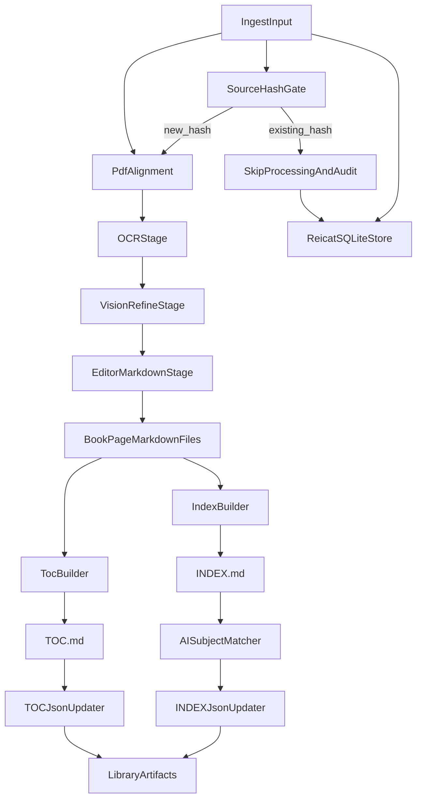

# PRD — Fase 1 Ingestione Libri

## 1. Executive Summary

- **Problem Statement**: L’ingestione dei libri è oggi parziale e non standardizzata rispetto agli obiettivi di biblioteca semantica; serve una pipeline affidabile che trasformi PDF in asset strutturati e aggiornabili nel tempo.
- **Proposed Solution**: Implementare una pipeline di ingestione end-to-end che parte da PDF + metadati REICAT, produce pagine Markdown allineate, aggrega TOC/INDEX, aggiorna SQLite e mantiene file globali `TOC.json`/`INDEX.json` con riconciliazione AI dei soggetti.
- **Success Criteria**:
  - 100% dei libri ingestiti produce cartella output con pagine `.md` per tutte le pagine utili del PDF allineato.
  - 100% dei libri con range TOC/INDEX valido produce rispettivamente `TOC.md` e `INDEX.md` non vuoti.
  - 100% degli inserimenti REICAT crea/aggiorna una riga in SQLite senza duplicati di libro.
  - Se il PDF in input ha lo stesso `sha256` di un libro già processato, il sistema non riesegue OCR/processing e restituisce stato `already_processed`.
  - 100% delle esecuzioni aggiorna `TOC.json` e `INDEX.json` in modo idempotente (riesecuzione senza duplicazioni).
  - Matching AI dei soggetti INDEX disponibile su endpoint OpenAI-compatible sia locale sia esterno.

## 2. User Experience & Functionality

- **User Personas**:
  - Operatore di ingestione (fornisce input iniziale: PDF, REICAT, range e pagine da eliminare).
  - Pipeline Orchestrator (servizio automatico che esegue l’intero flusso senza intervento umano).

- **User Stories**:
  - Come operatore, voglio fornire PDF, metadati REICAT e range pagine speciali, così da ottenere un libro ingestito e allineato.
  - Come orchestratore automatico, voglio eseguire la pipeline in modo deterministico, così che lo stesso input produca lo stesso output nel 99,99% dei casi.
  - Come orchestratore automatico, voglio bloccare la rielaborazione quando il `sha256` del PDF è già noto, così da evitare computazione duplicata anche con REICAT leggermente diverso.
  - Come orchestratore automatico, voglio aggiornare la tabella REICAT con operazione di upsert usando come ID univoco lo `sha256` del PDF, così da mantenere un record consistente per ogni file sorgente.
  - Come sistema biblioteca, voglio aggiornare `TOC.json` e `INDEX.json` con deduplica semantica dei soggetti, così da mantenere una base cumulativa coerente tra libri.
  - Come team tecnico, voglio poter usare endpoint AI locale o esterno con API OpenAI-compatible, così da mantenere flessibilità operativa.

- **Acceptance Criteria**:
  - Input ingestione obbligatorio: file PDF, dati REICAT, pagine da eliminare, range TOC (start/end), range INDEX (start/end).
  - Calcolo obbligatorio `sha256` del PDF originale prima di ogni processing.
  - Se `sha256` già presente nello storico ingestione: nessuna riesecuzione OCR/LLM; viene registrato solo evento di skip con motivo `duplicate_source_hash`.
  - Tabella REICAT aggiornata con semantica upsert su chiave primaria `source_sha256` (hex digest SHA-256 del PDF originale).
  - Il PDF allineato è generato applicando in ordine deterministico le pagine da eliminare.
  - La pipeline OCR 3-stadi viene reimplementata localmente mantenendo comportamento base di `/Users/oni/Desktop/RagAIO.py`:
    - OCR testo (`ocrWithEasyOCR`)
    - Refinement vision (`refineWithVision`)
    - Refinement editor markdown (`refineWithEditor`)
  - L’esecuzione non è strettamente sequenziale pagina-per-pagina: il sistema usa parallelizzazione configurabile su più pagine e richieste LLM concorrenti.
  - Il numero massimo di job paralleli, retry, timeout e rate-limit è configurabile senza modificare codice.
  - Output per libro in cartella dedicata con pagine markdown singole.
  - `TOC.md` contiene la concatenazione ordinata delle pagine TOC del range fornito.
  - `INDEX.md` contiene la concatenazione ordinata delle pagine INDEX del range fornito.
  - SQLite aggiornato/creato con record libro e campi REICAT.
  - `TOC.json` aggiornato con struttura `{libro: {capitolo: [pagina_inizio, pagina_fine]}}`.
  - `INDEX.json` aggiornato con struttura `{soggetto: {libro: [pagine]}}`, con riconciliazione AI tra soggetti equivalenti.
  - Il processo supporta ingestione incrementale di nuovi libri in esecuzioni successive.
  - In caso di `sha256` già noto ma REICAT differente, i metadati vengono gestiti come aggiornamento metadati (auditabile) senza rifare la trasformazione PDF→MD.

- **Non-Goals**:
  - Non include la Fase 2 di ricerca/generazione articoli.
  - Non include una UI avanzata/multi-pagina con funzionalità editoriali complesse.
  - Non include inserimento dati frammentato su fonti multiple o procedure manuali incoerenti.
  - Non include migrazione a DB diversi da SQLite in questa fase.

- **Chiarimento UX input (in scope)**:
  - È in scope un punto unico di inserimento dati consistente per l’avvio ingestione (preferibilmente pagina HTML singola; alternativa script CLI guidato).
  - L’interfaccia deve raccogliere in un unico flusso: PDF, REICAT, pagine da eliminare, range TOC e range INDEX.
  - L’obiettivo è eliminare input distribuiti su più canali/file non sincronizzati.

## 3. AI System Requirements

- **Tool Requirements**:
  - Client OpenAI Python (`openai`) con configurazione endpoint OpenAI-compatible.
  - Modalità duale endpoint:
    - Locale (es. Ollama/OpenAI-compatible).
    - Esterno (provider API compatibile).
  - Reuso logico della pipeline OCR presente in `/Users/oni/Desktop/RagAIO.py` per i tre stadi.

- **Evaluation Strategy**:
  - Fase attuale: la pipeline e gli artefatti devono esistere ed essere esercitabili; la verifica può essere manuale o smoke su alcuni libri (presenza file, range TOC/INDEX, skip su `sha256`, merge `INDEX.json`).
  - POI: introdurre gradualmente benchmark ripetibili, gold set per matching soggetti e/o unit test automatizzati; non sono vincoli di uscita per la prima messa in strada.

## 4. Technical Specifications

- **Architecture Overview**:

- **Integration Points**:
  - OCR/LLM pipeline reference: `/Users/oni/Desktop/RagAIO.py`
  - API AI: endpoint OpenAI-compatible con `base_url` e `api_key` configurabili runtime.
  - Metadata store: SQLite (tabella libri + campi REICAT + registro hash sorgente + audit aggiornamenti metadati).
  - Artefatti globali biblioteca: `TOC.json`, `INDEX.json`.

- **Configurazione Runtime**:
  - Il sistema usa un unico file `.env` come fonte di configurazione runtime.
  - Ogni macchina parte da configurazione standard e la personalizza in base alle risorse disponibili.
  - Il file `.env` viene creato derivandolo da `example.env` con valori dummy/documentativi.
  - Parametri minimi configurabili:
    - endpoint e chiavi locali/esterne OpenAI-compatible
    - model id Vision/Editor
    - parallelismo OCR/LLM
    - timeout e retry
    - path I/O e path SQLite
  - In assenza di variabili obbligatorie, il sistema fallisce con errore esplicito e riferimento a `example.env`.

- **Security & Privacy**:
  - Nessuna chiave hardcoded nel codice di produzione.
  - Anche le chiavi di contesto (non di processo) devono essere definite in `.env` e referenziate solo tramite variabili d’ambiente.
  - Logging senza esporre dati sensibili o credenziali.
  - Tracciabilità minima per libro ingestito (timestamp, input hash, versione pipeline).

## 5. Risks & Roadmap

- **Phased Rollout**:
  - **MVP**:
    - Input validato (PDF + REICAT + ranges + pagine da eliminare).
    - Source hash gate (`sha256`) con skip su duplicati.
    - PDF allineato.
    - Reimplementazione OCR 3-stadi locale.
    - Parallelizzazione configurabile della pipeline con controllo concorrenza.
    - File di configurazione runtime con endpoint/modelli/timeout/retry/parallelismo.
    - Output pagine `.md`, `TOC.md`, `INDEX.md`.
    - SQLite aggiornato.
  - **v1.1**:
    - Aggiornamento robusto di `TOC.json` e `INDEX.json` con deduplica idempotente.
    - Matching AI soggetti con fallback deterministico (normalizzazione lessicale).
  - **v2.0**:
    - Hardening ingestione incrementale multi-libro (recovery, atomicità aggiornamenti artefatti globali, log/audit).
  - **POI**:
    - Benchmark qualità/performance/affidabilità e/o unit test formali quando necessari.

- **Technical Risks**:
  - Divergenza output tra endpoint AI locale ed esterno sul matching soggetti.
  - Errori di allineamento pagina se input pagine da eliminare incompleto.
  - OCR su PDF rumorosi con possibile degradazione di TOC/INDEX parsing.
  - Crescita `INDEX.json` con conflitti semantici tra soggetti simili.

- **Mitigazioni operative concordate**:
  - Usare `temperature` bassa come default nei passaggi Vision/Editor.
  - Usare `system prompt` vincolante e stabile, orientato alla fedeltà del testo.
  - Versionare i prompt in configurazione per tracciare differenze di comportamento.

## 6. Struttura del repository

La struttura delle cartelle del progetto (albero, principi e linee guida) è documentata in [`README.md`](README.md) così il PRD resta focalizzato su requisiti e comportamento, mentre il layout evolve con il codice.

## 7. Backlog task atomiche (derivate) e stato

Legenda: `[x]` completata, `[ ]` da fare.

- [x] **T1 — Definire contratto input ingestione**: schema unico con campi obbligatori (`pdf`, `reicat`, `pages_to_remove`, `toc_start/end`, `index_start/end`).
- [x] **T2 — Validazione input**: controlli sintattici/semantici (range validi, pagine non negative, file PDF presente).
- [ ] **T3 — Loader configurazione `.env`**: lettura variabili obbligatorie + errore esplicito se mancanti, con riferimento a `example.env`.
- [x] **T4 — Calcolo `sha256` sorgente**: funzione su PDF originale.
- [ ] **T5 — SourceHashGate**: verifica hash già noto e ritorno stato (`new_hash` vs `already_processed`/`duplicate_source_hash`).
- [ ] **T6 — Schema SQLite minimo**: tabella libro + campi REICAT + audit metadata update + chiave univoca `source_sha256`.
- [ ] **T7 — Upsert REICAT per hash**: inserimento/aggiornamento metadata senza duplicati.
- [ ] **T8 — Skip path completo**: se hash duplicato, niente OCR/LLM, solo audit + update metadata.
- [ ] **T9 — PdfAlignment deterministico**: applicazione ordinata di `pages_to_remove` e generazione PDF allineato.
- [ ] **T10 — Enumerazione pagine utili**: mappatura robusta pagina originale -> pagina allineata.
- [ ] **T11 — Stage OCR base**: estrazione testo pagina per pagina.
- [ ] **T12 — Stage Vision refine**: raffinamento su endpoint OpenAI-compatible (locale/esterno configurabile).
- [ ] **T13 — Stage Editor markdown refine**: normalizzazione finale markdown.
- [ ] **T14 — Orchestrazione concorrente**: coda job con `max_parallel`, retry, timeout e rate-limit da config.
- [ ] **T15 — Persistenza pagine `.md`**: una pagina markdown per ogni pagina utile.
- [ ] **T16 — Builder `TOC.md`**: concatenazione ordinata del range TOC.
- [ ] **T17 — Builder `INDEX.md`**: concatenazione ordinata del range INDEX.
- [ ] **T18 — Logging/audit minimo**: timestamp, hash, versione pipeline, esito.
- [x] **T19 — Smoke test end-to-end (nuovo hash)**: copertura parziale con test automatici su validazione ed edge case.
- [x] **T20 — Smoke test duplicate hash**: copertura preliminare lato hash calculation; scenario hash-gate completo ancora da implementare.
