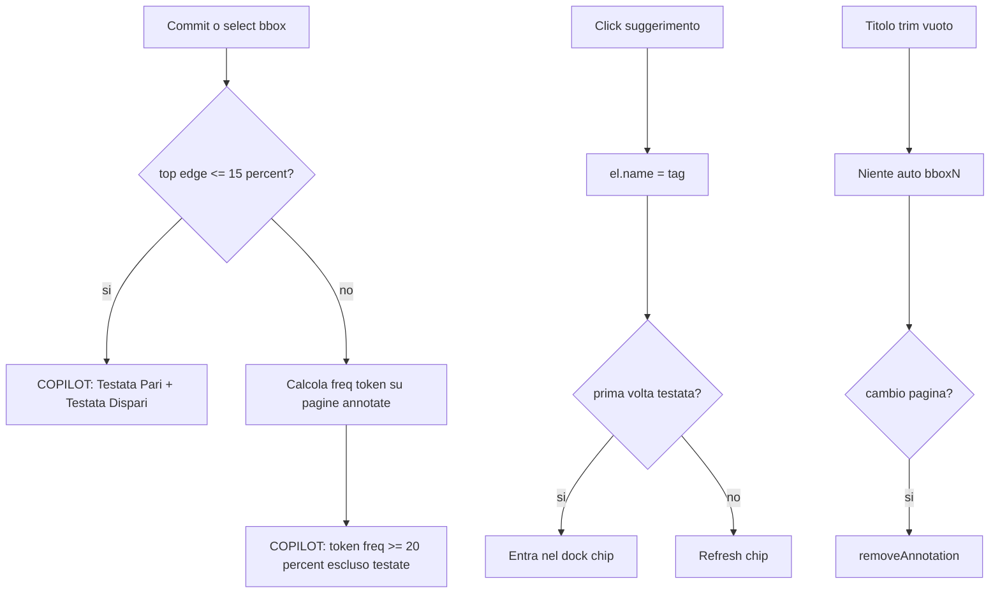

# PRD — Ingest: compilazione note bbox (testate, COPILOT, no-drag)

> Scope: UX annotazione sulla pagina ingest (`web/dashboard/page-guidance*.js|css`, dock tag).  
> Non tocca backend ingest / pipeline OCR. Data: 2026-08-23.

---

### 1. Executive Summary

- **Problem Statement**: In compilazione note, riprendere una bbox per editare il titolo spesso “impiglia” la shape al cursore (drag involontario); i suggerimenti tag non aiutano a etichettare le **testate di pagina** (riga tipografica alto-pagina: n. pagina / titolo libro) vs il resto del contenuto; svuotare il titolo rimette subito un placeholder e lascia annotazioni spurie.
- **Proposed Solution**: (1) bbox esistenti **non spostabili né ridimensionabili** (resta solo draw-to-create); (2) pannello **COPILOT** accanto all’editor titolo con suggerimenti contestuali alla posizione Y della bbox — in top 15% pagina: **Testata Pari** / **Testata Dispari** (anche a libro vuoto); sotto: tag frequenti (≥20% pagine annotate), senza le testate; (3) titolo lasciabile vuoto; se si lascia la pagina con titolo ancora vuoto, l’annotazione si **cancella**.
- **Success Criteria**:
  1. Dopo mousedown su bbox esistente per editare il titolo, la shape **non** segue il cursore in nessun caso (incluso mouseup fuori canvas).
  2. Con bbox testo il cui bordo superiore cade nel top 15% dell’altezza pagina, COPILOT mostra almeno **Testata Pari** e **Testata Dispari** anche se il pool chip è ancora vuoto.
  3. Testata Pari/Dispari compaiono nel **pool chip** solo dopo il primo uso (prima applicazione come titolo di una annotazione).
  4. Sotto il top 15%, COPILOT elenca solo tag (non-testata) presenti su ≥20% delle pagine che hanno almeno un’annotazione grafica, ordinate per frequenza decrescente.
  5. Titolo svuotato resta vuoto in UI; cambio pagina (o chiusura editor con titolo vuoto al cambio pagina) elimina l’annotazione senza lasciare `bboxN` fantasma.

---

### 2. User Experience & Functionality

#### User Personas

- **Operatore ingest (lab)**: annota PDF in desktop, tema scuro; assegna tag alle primitive per guidance AI e mentions `@` nelle note.

#### Glossario

| Termine | Significato |
|---------|-------------|
| **Testata** | Fascia tipografica in alto pagina (es. numero pagina, titolo libro / sezione corrente). **Non** è un heading Markdown (`#` / `##`). |
| **Testata Pari** / **Testata Dispari** | Due tag di sistema per testate su pagine pari vs dispari del PDF (numerazione viewer / allineata pagina corrente). |
| **COPILOT** | Pannello suggerimenti titolo accanto (SX) all’editor nome bbox, contestuale alla posizione della shape. |
| **Pool** | Chip NOTE-TAG aggregati nel dock sotto griglia+preview (`mention-chips`). |
| **Top 15%** | Regione verticale pagina: bordo superiore della bbox (coord Y DeepSeek / canvas) ≤ 15% dell’altezza utile pagina. |

#### User Stories

**US-1 — Bbox non trascinabili**

- `As an operatore ingest, I want le bbox già create non siano né spostabili né ridimensionabili so that posso riaprire il titolo senza che la shape si attacchi al cursore.`

Acceptance Criteria:

- Hit su bbox/point/trail **esistente**: seleziona + apre/focus editor titolo se doppio click o flusso rename attuale; **non** avvia `drag.mode = "move"` né `"resize"`.
- Creazione nuova bbox: drag-to-draw (`drag.mode = "bbox"`) resta invariato.
- Point click-to-place e trail restano come oggi (nessun move successivo).
- Mouseup fuori canvas non lascia uno stato di drag residuo (nessuna shape che “segue” al rientro sul canvas).
- Non-goal collaterale: non introdurre un nuovo tool “muovi”; per correggere geometria si cancella e si ridisegna.

**US-2 — COPILOT in top 15%: Testata Pari / Testata Dispari**

- `As an operatore ingest, I want suggerimenti Testata Pari e Testata Dispari quando disegno una bbox testo in alto pagina so that etichetto le testate tipografiche senza confonderle con heading MD.`

Acceptance Criteria:

- Trigger: tool bbox, shape (draft commit o selezione) con **top edge** nella fascia **≤ 15%** altezza pagina.
- UI: pannello **COPILOT** a **sinistra** della casella titolo bbox; voci cliccabili che applicano il nome (come `applyNameFromPool`).
- Sempre presenti in questo contesto (anche **prima nota del libro**, pool vuoto): **Testata Pari**, **Testata Dispari**.
- Opzionale MVP+: sotto le due testate, fino a **TOP 5** altre tag già nel pool della sezione corrente (escluso le due testate), ordinate per frequenza — se assente in MVP, documentare in Non-Goals e rimandare a v1.1.
- Label UI: **COPILOT** (non “HEADER”). Copy/tooltip può chiarire “testata di pagina”.

**US-3 — COPILOT sotto il top 15%: tag frequenti**

- `As an operatore ingest, I want nel resto pagina un COPILOT con le tag già usate di frequente so that riuso etichette coerenti senza digitare.`

Acceptance Criteria:

- Trigger: bbox (o rename) con top edge **> 15%** altezza pagina.
- Sorgente: token delle annotazioni grafiche sulle pagine del PDF corrente che hanno ≥1 annotazione; frequenza = (# pagine in cui il token compare almeno una volta) / (# pagine con ≥1 annotazione).
- Inclusione: frequenza **≥ 0.20** (20%+).
- Ordinamento: frequenza decrescente; tie-break alfabetico `it`.
- **Esclusione**: token **Testata Pari** e **Testata Dispari** (restano solo nel COPILOT top-15%).
- Se nessuna tag soddisfa la soglia: COPILOT vuoto o hint breve (“Nessun suggerimento ancora”) — non inventare tag.

**US-4 — Testate nel pool solo dopo primo uso**

- `As an operatore ingest, I want Testata Pari/Dispari nel pool chip solo dopo averle usate so that il dock non si riempie di tag di sistema non ancora applicate.`

Acceptance Criteria:

- Prima del primo `el.name` uguale a una delle due testate (match token normalizzato `mentionToken`): **assenti** dal dock chip.
- Dopo il primo uso su qualsiasi pagina del libro/sessione annotazione: compaiono nel pool come le altre tag (aggregazione / cite / `@` invariati).
- Restano sempre offribili da COPILOT in top 15% anche se non ancora nel pool.

**US-5 — Titolo vuoto e cancellazione annotazione**

- `As an operatore ingest, I want poter svuotare il titolo bbox senza che torni il placeholder, e se cambio pagina a titolo ancora vuoto la nota si cancella so that non restano bboxN spurie.`

Acceptance Criteria:

- Campo titolo editabile fino a stringa vuota; **non** richiamare `defaultNameFor` / non riscrivere `bboxN` su `input` vuoto.
- Mentre il titolo è vuoto: l’annotazione può restare selezionata in editing; chip/token non espongono un nome fantasma (o restano nascosti finché il nome non è non-vuoto — comportamento coerente con pool).
- **Cambio pagina** (detail page picker / freccia / thumb) con annotazione ancora a titolo vuoto (trim): **rimuovere** quell’annotazione dallo stato (equivalente delete).
- Se l’utente scrive un titolo non vuoto prima del cambio pagina: annotazione persistita normalmente.
- Escape / blur senza cambio pagina: titolo può restare vuoto senza auto-fill; cancellazione definitiva al cambio pagina (non al solo blur), salvo che blur+navigate siano lo stesso evento di cambio pagina.

#### Non-Goals

- Drag/move/resize di point e trail oltre quanto già escluso da US-1 (stesso “no move” per coerenza).
- Inference automatica pari/dispari sull’applicazione del click (l’operatore sceglie Testata Pari vs Dispari).
- Suggerimenti COPILOT basati su LLM / vision (solo euristiche locali sul pool).
- Cambiare semantica Markdown heading o regola `md_asides` `{}`.
- Persistenza server-side dedicata alle sole testate oltre lo stato annotazioni / draft già esistente.
- Mobile / touch-first.
- TOP 5 pool extra nel COPILOT top-15% se non implementato in MVP (esplicito v1.1).

---

### 3. AI System Requirements

This feature does not introduce AI/ML components.

(COPILOT qui = UI di suggerimento euristico sul pool locale, non modello AI.)

---

### 4. Technical Specifications

#### Architecture Overview

- Client-only su controller annotazioni ingest: [`web/dashboard/page-guidance.js`](web/dashboard/page-guidance.js), mentions/pool [`web/dashboard/page-guidance-mentions.js`](web/dashboard/page-guidance-mentions.js), stili [`web/dashboard/page-guidance.css`](web/dashboard/page-guidance.css), boot [`web/dashboard/page-guidance-boot.js`](web/dashboard/page-guidance-boot.js).
- Coordinate bbox già in spazio DeepSeek 0–999; top 15% ⇔ `min(y1,y2) / 999 ≤ 0.15` (o equivalente su canvas height).
- Costanti tag sistema: `Testata Pari`, `Testata Dispari` → token via `mentionToken` (spazi → `_`).

#### Integration Points

- **Disable move/resize**: in `mousedown` hit-test esistente, non settare `drag` move/resize; opzionale `window` `mouseup` per clear drag residuo sulla create-draw.
- **COPILOT DOM**: sibling di `.annotate-name-editor` (o figlio), posizionato a SX del titolo; show/hide con `showNameInputFor` / hide.
- **Frequenze**: da `getAnnotations()` / `state.pages` già in controller; riusare aggregazione simile a `itemsForSection`.
- **Pool gate testate**: `renderChips` / `itemsForSection` filtrano via “usato almeno una volta” (già vero se solo annotazioni reali alimentano il pool — le due testate **non** vanno iniettate nel dock finché non esiste un `el` con quel nome).
- **Titolo vuoto**: `commitNameFromInput` non deve ripristinare default su trim vuoto; hook `onDetailChange` / bridge cambio pagina → delete se `!String(el.name||"").trim()`.
- Auth/API: N/A.

#### Security & Privacy

- Solo stato client / draft annotazioni già previsti; nessun nuovo PII.
- Label fisse IT, non eseguirle come codice.

#### Open Questions

- Numerazione “pari/dispari”: pagina **viewer** (`pagePickerDetailPage`) vs pagina editoriale REICAT — default PRD: **indice pagina viewer** del PDF caricato.
- TOP 5 aggiuntive in COPILOT top-15%: MVP sì/no — default PRD: **v1.1** (MVP = solo le due testate).
- Cancellazione titolo vuoto anche su **Escape** senza cambio pagina: default PRD: **no** (solo cambio pagina).

---

### 5. Risks & Roadmap

#### Phased Rollout

| Fase | Scope |
|------|--------|
| **MVP** | US-1 no-drag/resize; US-2 COPILOT top-15% con Testata Pari/Dispari; US-3 COPILOT frequenze ≥20%; US-4 pool solo post-uso; US-5 titolo vuoto + delete on page change |
| **v1.1** | TOP 5 tag pool extra in COPILOT top-15%; polish empty-state COPILOT; keyboard apply suggerimenti |
| **v2** | TBD: euristiche tipografiche automatiche / LLM — fuori scope |

#### Technical & Product Risks

| Rischio | Mitigazione |
|---------|-------------|
| Operatore vuole spostare bbox dopo draw | Accettato: ridisegna; documentare in UI hint breve se serve |
| Soglia 20% troppo alta a inizio libro | COPILOT corpo vuoto ok; testate restano in top 15% |
| Confusione “testata” vs heading MD | Copy COPILOT + PRD glossario; niente `#` obbligatorio nei nomi testata |
| Titolo vuoto dimenticato cancella lavoro | Delete solo al cambio pagina; durante edit si può riscrivere |

#### Out of Scope / Future

- Auto-detect testata da OCR/vision.
- Suggerimenti per point/trail oltre bbox testo (MVP: focus bbox; estendere se lo stesso editor nome è condiviso — stesso COPILOT se Y del punto in top 15%).
