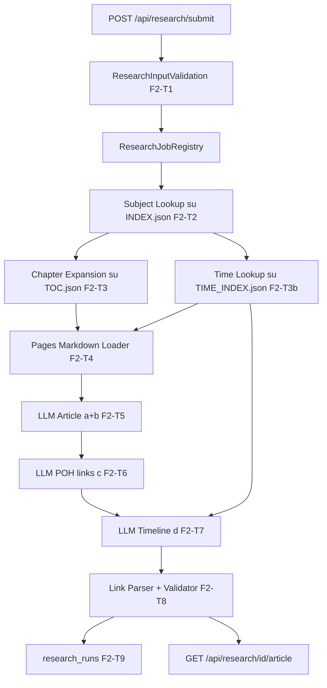

# PRD — librarAIn Fase 2: Ricerca (Research)

> Documento dedicato alla **Fase 2 — Ricerca** del prodotto librarAIn. Estrae, aggiorna ed espande
> le sezioni Fase 2 di [`PRD-Fase1.md`](PRD-Fase1.md) (§2.3, §2.5, §4.2, §7 F2-T*), che resta la
> fonte di verità per la Fase 1 Upload e per le convenzioni condivise.
> Allineato al manoscritto in `trascrizione-fogli-manoscritti.md` (sezione RICERCA, passi `a`–`d`)
> e allo stato codebase al **2026-06-12**.

## 0. Contesto e assunzioni ereditate

### 0.1 Relazione con PRD-Fase1

- Le assunzioni **A1–A8** di `PRD-Fase1.md` §0 valgono integralmente anche qui. In particolare:
  **A2** (la Fase 2 implementa *tutti* i passi `a`–`d` del manoscritto in MVP), **A3** (nessun
  Milvus/RAG vettoriale: retrieval via polyindex), **A8** (provider AI unico OpenAI-compatible
  con override per stage).
- Le convenzioni di formattazione Markdown (link `source:`, link `poh:`, sezione `## Cronologia`)
  sono **definite qui** in §2.4 e sostituiscono §2.5.1 di PRD-Fase1 come riferimento normativo.

### 0.2 Stato codebase rilevante per la Ricerca (2026-06-12)

| Componente | Stato | Note |
|---|---|---|
| `polyindex/TOC.json` | ✅ presente (T23) | struttura capitoli cross-book, merge atomico + lock |
| `polyindex/INDEX.json` | ✅ presente (T26) | soggetti canonici cross-book + AI subject matcher (T25) |
| `polyindex/TIME_INDEX.json` | ✅ presente (T-EXT) | anni/date → libri/pagine; **nuovo input deterministico per il passo `d`** |
| `data/output/<sha>/pages/p.NNNN.<slug>.md` | ✅ presente (T15) | contenuti pagina per il contesto LLM |
| `data/output/<sha>/manifest.json` | ✅ presente (T15) | validazione citazioni `source:` |
| `src/core/openai_client.py` | ✅ presente (T12a) | client unico per il modello Research |
| `src/api/ingest_http_server.py` + `job_registry.py` | ✅ presente | `ThreadingHTTPServer`; la Ricerca si aggancia qui (no FastAPI in MVP) |
| `src/search/request_schema.py` + `request_validation.py` | ✅ presente (F2-T1) | `ResearchRequest`/`ResearchOptions` + errori 400 strutturati |
| `src/search/subject_lookup.py` | ✅ presente (F2-T2) | Subject Lookup read-only su `INDEX.json`: match deterministico + semantico (embedding intera query, riuso T25); fallback solo-deterministico se AI giù |
| `src/search/chapter_expansion.py` | ✅ presente (F2-T3) | Chapter Expansion read-only su `TOC.json`: pagina → capitolo; espansione a capitolo intero se < 6 pagine; budget `max_books`/`max_pages_per_book` |
| `src/search/time_lookup.py` | ✅ presente (F2-T3b) | Time Lookup read-only su `TIME_INDEX.json`: regex `extract_time_references` su query/`poh.time_range`; range con fallback anno inizio; `timeline_candidates` + arricchimento pagine (budget merge → F2-T4) |
| `src/search/article_catalog.py` + `research_handlers.py` | ⚠️ scaffold | catalogo/generazione articoli HTML per POH; non è la pipeline query F2-T4+ |
| `web/ricerca.html` | ⚠️ scaffold | ricerca su catalogo articoli; non equivale a F2-T11 (`search.html`) |
| `src/search/` (pipeline query) | ⚠️ parziale | lookup ✅ (F2-T2); expansion ✅ (F2-T3); time lookup ✅ (F2-T3b); loader/LLM/postprocess F2-T4+ |
| Tabella `research_runs` | ❌ assente | migration dedicata (F2-T9) |

**Aggiornamento chiave rispetto a PRD-Fase1**: il passo `d` (cronologia) non è più demandato al
solo LLM. `TIME_INDEX.json` fornisce un pre-filtro deterministico `{anno/data → libri/pagine}`
che vincola le righe della tabella `## Cronologia` a riferimenti temporali realmente presenti
nelle fonti, riducendo le date inventate (vedi §2.3 punto 6 e §4.1).

## 1. Executive Summary

- **Problem Statement**: la biblioteca ingerita in Fase 1 (pagine Markdown + polyindex cross-book)
  non è ancora interrogabile: uno storico non può porre una domanda e ottenere una sintesi
  verificabile; i soggetti, i capitoli e i riferimenti temporali estratti restano dati passivi.
- **Proposed Solution**: una API di Ricerca asincrona che, data una query in linguaggio naturale
  (con POH opzionale), (1) seleziona deterministicamente capitoli e pagine candidate via
  `INDEX.json` + `TOC.json` + `TIME_INDEX.json`, (2) genera con LLM un **unico file Markdown** in
  stile Wikipedia con citazioni `source:` verso le pagine libro (passi `a`–`b`), hyperlink `poh:`
  agli altri POH menzionati (passo `c`) e sezione `## Cronologia` tabellare come proiezione
  verticale della time bar (passo `d`), (3) valida post-hoc ogni link contro `manifest.json` e il
  registro soggetti.
- **Success Criteria**:
  - ≥80% di una gold set di 20 query produce un Markdown che soddisfa **tutti** i passi `a`–`d`
    (articolo, link fonti, link POH, sezione `## Cronologia` valida).
  - **Precisione citazioni ≥95%**: ogni link `source:` sopravvissuto al post-validatore risolve a
    una pagina esistente in `manifest.json` del libro citato.
  - **0 link `poh:` orfani non marcati**: ogni `poh:` punta a un `canonical_id` noto in
    `INDEX.json` oppure è esplicitamente `poh:unknown-<slug>` con TODO in `## Annotazioni`.
  - **≥90% delle righe `## Cronologia` con fonte**: colonna Fonti con almeno un `source:` valido
    (tolleranza: max 1 riga consecutiva con `—` per contesto temporale derivato).
  - Latenza end-to-end di una ricerca (5 libri × 8 pagine di contesto, endpoint AI raggiungibile)
    **< 5 min p95**; pre-filtro deterministico (lookup+expansion+loader) **< 5 s**.
  - 100% delle esecuzioni produce una riga in `research_runs` con stato finale, hash query e audit
    di libri/pagine usati come contesto.

## 2. User Experience & Functionality

### 2.1 Personas

- **Storico/Ricercatore**: utente finale che pone domande di dominio (eventualmente legate a un
  POH) e si aspetta un articolo coerente, in italiano, con citazioni puntuali e navigabili.
- **Pipeline Orchestrator**: servizio automatico che invoca la Ricerca in batch (test, rigenerazione
  articoli POH) senza intervento umano; richiede job model asincrono e idempotenza.
- **Curatore biblioteca**: usa l'audit (`research_runs`, log) per verificare quali fonti hanno
  alimentato un articolo e per fare debugging dei falsi match di soggetto.

### 2.2 User Stories

**Storico/Ricercatore**

- Come ricercatore, voglio inviare una query in linguaggio naturale (con riferimento opzionale a un
  POH), così da ricevere un articolo che sintetizzi le informazioni rilevanti tratte dai libri
  indicizzati. *(passo `a`)*
- Come ricercatore, voglio che ogni affermazione non triviale riporti una citazione verificabile
  come **link Markdown** `source:` verso la pagina libro, così da aprire la fonte senza HTML, in
  stile Perplexity. *(passo `b`)*
- Come ricercatore, voglio che i POH menzionati diversi dal soggetto principale siano **hyperlink
  Markdown** `poh:`, così da navigare verso altri articoli o risolverli da tooling. *(passo `c`)*
- Come ricercatore, voglio una **cronologia verticale** (tabella ordinata dal più antico al più
  recente) nel documento, così da vedere subito l'ordine degli eventi citati. *(passo `d`)*
- Come ricercatore, voglio sapere esplicitamente quando la biblioteca non contiene materiale
  sufficiente per la mia query, così da non ricevere un articolo allucinato.

**Pipeline Orchestrator**

- Come orchestratore, voglio che la ricerca sia asincrona con lo stesso job model dell'ingest
  (202 + `request_id`, polling stato, eventi), così da gestire query lunghe senza bloccare il
  client.
- Come orchestratore, voglio che il pre-filtro sia deterministico e con budget bounded
  (`max_books`, `max_pages_per_book`), così da avere costi e tempi predicibili.
- Come orchestratore, voglio idempotenza opzionale (stessa query + stesso stato polyindex entro
  TTL → stesso `request_id`), così da evitare rigenerazioni inutili in batch.

**Curatore biblioteca**

- Come curatore, voglio che ogni run di ricerca registri in `research_runs` i libri e le pagine
  effettivamente usati come contesto, così da poter ricostruire a posteriori la provenienza di
  ogni articolo.
- Come curatore, voglio che i link `source:` non risolvibili vengano rimossi e loggati (non
  silenziosamente serviti), così da individuare regressioni del polyindex.

### 2.3 Acceptance Criteria — API e pipeline

**Endpoint (montati sul server HTTP attuale, `src/api/ingest_http_server.py`)**

1. `POST /api/research/submit` accetta body JSON:

   ```json
   {
     "query": "string, obbligatoria, 3–2000 caratteri",
     "poh": {"id": "string?", "label": "string", "time_range": "string?"},
     "options": {
       "max_books": 5,
       "max_pages_per_book": 8,
       "dedup": true
     }
   }
   ```

   Risposta `202` con `{request_id, status: "accepted"}`. Errori: `400` su body non valido (campo
   `error` con dettaglio), `401` se `INGEST_API_TOKEN` è configurato e assente/errato, `429` se la
   coda research supera `RESEARCH_MAX_CONCURRENT_JOBS`.
2. `GET /api/research/{request_id}` ritorna `{status: accepted|running|succeeded|failed,
   pipeline_version, last_error?, events: [...ultimi N]}`. `404` su id ignoto.
3. `GET /api/research/{request_id}/article` ritorna, solo a stato `succeeded`:

   ```json
   {
     "markdown": "…articolo completo UTF-8…",
     "citations": [{"source_sha256": "…", "aligned_page": 112, "label": "…"}],
     "pohs_referenced": [{"poh_id": "marco-polo", "label": "…", "linked_from_count": 3}],
     "timeline_rows": [{"period": "1271–1295", "event": "…", "source_links": ["source:…"]}]
   }
   ```

   I campi strutturati duplicano ciò che è già nel Markdown per consumo programmatico. `409` se il
   job non è `succeeded`.
4. SSE `GET /api/research/{request_id}/events` (parità con ingest; facoltativo in MVP, richiesto
   per la UI v1.1).

**Pipeline (responsabilità logiche; le chiamate LLM possono essere fuse, vedi §3.2)**

5. **Pre-filtro deterministico** (nessuna chiamata LLM eccetto il subject matcher sui residui):
   1. *Subject Lookup*: estrazione soggetti dalla query (normalizzazione deterministica di
      `index_md_parser.normalize_label` + match su `canonical_label`/`aliases` di `INDEX.json`);
      AI subject matcher (riuso T25) solo sui soggetti residui non risolti. Output:
      `{source_sha256: [aligned_pages]}`.
   2. *Chapter Expansion*: per ogni pagina candidata, recupero del capitolo contenitore via
      `TOC.json`; se il capitolo è < 6 pagine si aggiungono le pagine vicine del capitolo, entro
      il budget.
   3. *Time Lookup* (**nuovo**): se la query o il `poh.time_range` contengono riferimenti
      temporali (riuso di `time_index.extract_time_references`), lookup in `TIME_INDEX.json` per
      arricchire le pagine candidate e per costruire la lista `timeline_candidates`
      `[{label, source_sha256, aligned_pages}]` passata al passo `d`.
   4. *Pages Loader*: lettura dei `pages/p.NNNN.<slug>.md` da `data/output/<sha>/`, troncamento al
      budget (`max_books` × `max_pages_per_book`, default 5 × 8), ordinamento per libro/pagina.
6. **Passi `a`+`b`**: generazione articolo con `src/search/prompts/article_prompt.md`: stile
   Wikipedia, in **italiano**, solo link Markdown CommonMark alle fonti (`source:`), niente
   `<a href>`. Ogni paragrafo con affermazioni fattuali deve contenere ≥1 link `source:`.
7. **Passo `c`**: linking POH con `poh_links_prompt.md` (o fuso nel turno precedente): ogni
   menzione di un POH presente in `poh_candidates` (derivati da INDEX + query) diventa
   `[etichetta](poh:<poh_id>)`. Il POH principale **non** va linkato a se stesso nel paragrafo di
   lead; ripetizioni successive sì. Entità non a registro → `poh:unknown-<slug>` + TODO in
   `## Annotazioni`.
8. **Passo `d`**: generazione sezione `## Cronologia` con `timeline_prompt.md`, vincolata ai
   `timeline_candidates` di TIME_INDEX dove disponibili: una data può comparire in tabella solo se
   (i) presente nei `timeline_candidates`, oppure (ii) presente testualmente nelle pagine di
   contesto, con link `source:` nella stessa riga. Formato normato in §2.4.
9. **Post-processing deterministico**: parsing di tutti i link del Markdown; ogni `source:` risolto
   contro `manifest.json` (sha + pagina allineata esistenti) — link invalidi rimossi e sostituiti
   con `*[[fonte non verificabile]]*` + log warning; ogni `poh:` verificato contro i
   `canonical_id` di `INDEX.json`; validazione strutturale tabella `## Cronologia` (3
   colonne, header fissi, ordine cronologico crescente); allineamento `citations`/`pohs_referenced`
   /`timeline_rows` JSON con il Markdown finale.

**Comportamenti su stati limite (definizione di Done)**

10. *Nessun soggetto matchato e nessuna pagina candidata*: il job termina `succeeded` con articolo
    minimo che dichiara l'assenza di materiale (template fisso, nessuna chiamata LLM di
    generazione) e `citations: []`; mai `failed` per query legittima senza risultati.
11. *Endpoint AI non raggiungibile*: retry con `src/core/retry.py` (classificazione
    transient/permanent); esaurito il retry, job `failed` con `last_error` esplicito; il subject
    matcher degrada al solo match deterministico (parità con T26).
12. *Polyindex assente o vuoto*: `POST /submit` risponde `202` ma il job fallisce subito con
    `last_error: "polyindex vuoto"` (lo stato della biblioteca è verificabile solo a runtime).
13. *Idempotenza*: con `options.dedup: true` (default), chiave = SHA-256 di
    `query normalizzata + poh.id + mtime/digest di INDEX.json`; se esiste un run `succeeded` con
    stessa chiave entro `RESEARCH_DEDUP_TTL_SECONDS` (default 3600), `submit` risponde `202` con il
    `request_id` esistente.

### 2.4 Formattazione Markdown normativa (fonti, POH, cronologia)

Convenzione **CommonMark** + **GFM** per le tabelle. Tutti i link in forma `[testo](URL)`, nessuno
spazio non-encoded nelle parentesi. Output primario = stringa Markdown UTF-8; niente HTML (le
entità già escaped nelle fonti restano come nel sorgente).

**Passo `b` — Link alle fonti**

- Forma canonica: `source:<source_sha256>:aligned:<p>` con `<p>` pagina **allineata** 1-based
  (coerente con `pages/p.NNNN.<slug>.md`).
  Esempio: `[Battaglia di Curzola, pp. 112–114](source:a1b2…f00:aligned:112)`.
- Testo in `[]`: titolo breve del fatto + riferimento pagina. Il link va ripetuto in ogni
  paragrafo che dipende da quella pagina (note a piè di pagina: v1.1).
- Il post-processore **deve** risolvere ogni `source:` contro `manifest.json`; link invalidi →
  rimossi, sostituiti con `*[[fonte non verificabile]]*`, loggati con `request_id`.

**Passo `c` — Link ad altri POH**

- Forma: `[Nome leggibile](poh:<poh_id>)`; in MVP `<poh_id>` = `canonical_id` di
  `INDEX.json` (chiave del dict `subjects`: slug ascii con trattini, max 32 char, es. `marco-polo`). Niente URL `http(s):` verso articoli POH (non esistono
  host stabili); `poh:` è un placeholder risolvibile da viewer/CLI.
- Entità non a registro: `[Nome](poh:unknown-<slug-normalizzato>)` + sezione finale
  `## Annotazioni` con bullet `TODO: risolvere poh:unknown-…`.

**Passo `d` — Vertical time bar come Markdown**

La "barra" è la lista verticale ordinata dal più antico al più recente. Sezione obbligatoria:

```markdown
## Cronologia

| Periodo | Evento | Fonti |
|---------|--------|-------|
| 1271–1295 | Marco Polo intraprende il viaggio verso la Cina. | [Sintesi dalle fonti](source:…:aligned:…) |
```

Regole:

- Titolo esattamente `## Cronologia` (H2, UTF-8).
- Tabella GFM con **esattamente** tre colonne, intestazioni fisse `Periodo`, `Evento`, `Fonti`.
- Colonna Fonti: ≥1 link `source:` valido, **oppure** `—` se l'evento è solo contesto temporale
  desunto da una fonte già citata nella riga precedente (max 1 riga consecutiva così).
- Ordine righe cronologico crescente; le etichette `Periodo` usano le convenzioni di
  `TIME_INDEX.json` (`"1271"`, `"1295 a.C."`, `"15 agosto 1271"`, range `"1271–1295"`).
- Vietati Mermaid e HTML per la tabella in MVP. La UI potrà proiettare la tabella su una time bar
  laterale senza modificare il sorgente.

### 2.5 Non-Goals

- Nessun Milvus, FAISS o backbone di retrieval vettoriale dedicato (eliminato dalla visione
  prodotto; gli embeddings restano interni al subject matcher).
- Nessuna UI di ricerca in MVP (`web/search.html` è v1.1; solo API).
- Nessun rendering HTML/PDF dell'articolo; il deliverable è il file Markdown.
- Nessun registro POH separato da `INDEX.json` in MVP (un "POH registry" autonomo con pagine
  dedicate è v2.0).
- Nessuna cache persistente degli articoli generati (solo dedup TTL in-process).
- Nessuna multi-tenancy, nessuna autenticazione utente oltre al token statico già previsto
  (`INGEST_API_TOKEN`), nessun fine-tuning di modelli.
- Nessuna migrazione del server HTTP a FastAPI per questa fase (resta T18.5, v2.0/on-demand).

## 3. AI System Requirements

### 3.1 Tool & Data Requirements

| Stage | Tipo | Config | Output atteso |
|---|---|---|---|
| Subject Matcher (riuso T25) | Embeddings + LLM dirimitore | `MATCHER_EMBEDDING_MODEL` + `MATCHER_LLM_MODEL` | `canonical_id` per i soggetti query residui |
| Research Article (`a`+`b`) | LLM testuale, long context utile | `RESEARCH_MODEL` | Corpo articolo Markdown + link `source:` |
| POH Links (`c`) | LLM testuale | `RESEARCH_MODEL` | Markdown con `[…](poh:…)` |
| Timeline (`d`) | LLM testuale | `RESEARCH_MODEL` | Sezione `## Cronologia` (tabella GFM) |

- Tutti i modelli via client OpenAI-compatible centralizzato (`src/core/openai_client.py`),
  endpoint unico configurato in `.env` (assunzione A8); supporto LM Studio con swap modelli come
  per Vision/Editor.
- **Dati in input**: esclusivamente artefatti di Fase 1 (`polyindex/*.json`, `pages/*.md`,
  `manifest.json`). Nessuna fonte esterna (no web search) in MVP.
- **Retention**: gli articoli generati non sono persistiti come artefatti in MVP (restano nel job
  registry in-process fino a riavvio); l'audit in `research_runs` è permanente. Persistenza
  articoli su disco: `TBD` (proposta: `data/research/<request_id>.md`, decidere in F2-T8 review).

### 3.2 Prompt di sistema (file nel repository)

Stesse regole di PRD-Fase1 §3.2: prompt come file Markdown nel repo, versionati da Git, mai
hardcoded in Python.

- `src/search/prompts/article_prompt.md` — passi `a`+`b`: stile Wikipedia, vincolo "rispondi solo
  se sostenuto dalle pagine fornite", formato `source:` obbligatorio.
- `src/search/prompts/poh_links_prompt.md` — passo `c`; **può essere fuso** in `article_prompt.md`
  se la qualità non degrada (decisione in F2-T6 con smoke test comparativo).
- `src/search/prompts/timeline_prompt.md` — passo `d`; riceve `timeline_candidates` da
  TIME_INDEX come vincolo esplicito.

Il diagramma in §4.1 descrive responsabilità logiche: 1, 2 o 3 chiamate LLM sono tutte
implementazioni ammesse purché l'output finale soddisfi §2.3 punti 6–8.

### 3.3 Evaluation Strategy

- **MVP (gate di uscita F2-T10)**: smoke E2E con 2 libri reali ridotti ingestiti + 5 query mock di
  cui ≥1 che richiede un POH secondario noto; verifica automatica: presenza `## Cronologia` con
  tabella valida, ≥1 `source:` valido per riga datata, ≥1 link `poh:` quando il testo menziona un
  secondo soggetto presente in INDEX, 0 `source:` non risolvibili nel Markdown finale.
- **v1.1**: gold set di 20 query con `expected_books`/`expected_subjects` (`TBD`: composizione
  della gold set dipende dai libri reali disponibili in biblioteca). Metriche:
  - *subject recall*: % soggetti attesi matchati dal lookup (target ≥85%);
  - *citation precision*: % link `source:` che puntano a pagine semanticamente pertinenti
    (campione con rating umano, target ≥90%);
  - *article informativeness*: rating umano 1–5 (target media ≥3.5);
  - *timeline soundness*: % righe Cronologia con data effettivamente presente nelle fonti linkate
    (target ≥95%).
- **POI**: benchmark mensile sulla gold set + regression test sui prompt (ogni modifica a
  `src/search/prompts/*.md` richiede una run della suite di eval prima del merge).

### 3.4 Safety / Guardrail

- System prompt vincolante: "rispondi solo se sostenuto dalle pagine fornite, altrimenti dichiara
  l'incertezza"; il template "assenza di materiale" (§2.3 punto 10) è la via d'uscita esplicita.
- `temperature` default 0.3 per Research (`RESEARCH_TEMPERATURE`), più libertà narrativa ma stesso
  vincolo di fonti; il post-validatore deterministico (§2.3 punto 9) è il guardrail finale contro
  citazioni inventate, indipendente dal comportamento del modello.
- Mai loggare testo pagina > 200 caratteri (`safe_text`), mai loggare chiavi API; il testo della
  query è loggato come hash + primi 80 caratteri.
- Nessun PII di default (i libri sono pubblicazioni); le query utente non sono condivise con
  terze parti oltre l'endpoint AI configurato.

## 4. Technical Specifications

### 4.1 Architecture Overview



**Data flow**: la query entra via HTTP, il pre-filtro produce un contesto bounded di pagine
Markdown; gli stage LLM trasformano contesto → articolo; il post-validatore garantisce che ogni
link in uscita sia risolvibile; l'audit registra cosa è stato letto e generato. Nessun dato viene
scritto nel polyindex dalla Ricerca (sola lettura).

**Layout modulo** (da creare):

```text
src/search/
├── __init__.py
├── request_schema.py      # ResearchRequest/ResearchOptions (F2-T1)
├── subject_lookup.py      # F2-T2 ✅ (riusa polyindex.subject_matcher)
├── chapter_expansion.py   # F2-T3 ✅
├── time_lookup.py         # F2-T3b ✅ (riusa polyindex.time_index)
├── pages_loader.py        # F2-T4
├── article_llm.py         # F2-T5 (+ F2-T6 se fusi)
├── timeline_llm.py        # F2-T7
├── postprocess.py         # F2-T8: parser/validator link + tabella
├── research_runner.py     # orchestrazione job (specchio di ingest_pipeline_runner)
└── prompts/
    ├── article_prompt.md
    ├── poh_links_prompt.md
    └── timeline_prompt.md
```

### 4.2 Modello di esecuzione HTTP

- **MVP**: gli endpoint research si montano sul server attuale (`ThreadingHTTPServer` in
  `src/api/ingest_http_server.py`), con un **job registry separato** per `research` ma stessa
  struttura base di `job_registry.py` (`request_id`, `status`, `events`, `pipeline_version`).
  Worker in background thread che invoca `research_runner.run_research` (asyncio interno per le
  chiamate LLM concorrenti, come l'orchestrator di ingest).
- Concorrenza: `RESEARCH_MAX_CONCURRENT_JOBS` (default 1, coda FIFO); le run research condividono
  il rate limiter token-bucket dell'endpoint AI (`src/core/rate_limit.py`) con le run di ingest.
- **Target v2.0** (invariato da PRD-Fase1 §4.3): migrazione FastAPI/async (T18.5) con job model
  formale; non bloccante per questa fase.

### 4.3 Integration Points

- **Polyindex (sola lettura)**: `data/polyindex/{TOC,INDEX,TIME_INDEX}.json`. Lettura senza lock
  (i writer garantiscono atomic replace, quindi una lettura vede sempre un file integro); cache
  in-memory per run con invalidazione su mtime.
- **Per-book artifacts (sola lettura)**: `data/output/<sha256>/{pages/, manifest.json}`.
- **Subject matcher (riuso)**: `src/ingestion/polyindex/subject_matcher.py` +
  `src/persistence/subject_matcher_sqlite.py` (cache embeddings `subject_embeddings`); il lookup
  query usa la stessa pipeline 2-stadi di T25/T26 (assunzione A4).
- **LLM**: `src/core/openai_client.py`, retry via `src/core/retry.py`, classificazione errori
  `src/core/errors.py`.
- **Persistence**: `data/db/biblioteca.csv` (SQLite, naming prodotto — assunzione A7); nuova
  tabella `research_runs` via migration in `book_sqlite.py`:

  ```sql
  CREATE TABLE research_runs (
    request_id TEXT PRIMARY KEY,
    query_hash TEXT NOT NULL,
    query_preview TEXT NOT NULL,          -- primi 80 char
    poh_id TEXT,
    status TEXT NOT NULL,                 -- accepted|running|succeeded|failed
    context_books_json TEXT NOT NULL,     -- {sha: [aligned_pages]} effettivamente caricati
    subjects_matched_json TEXT NOT NULL,  -- soggetti query → canonical_id
    citations_count INTEGER,
    pipeline_version TEXT NOT NULL,
    started_at TEXT NOT NULL,
    finished_at TEXT,
    last_error TEXT
  );
  ```

- **Logging/audit**: `bind_log_context(request_id=…)` a inizio run (riuso T18b); correlazione
  log ↔ `research_runs` via `request_id`.

### 4.4 Runtime configuration (`.env` esteso)

Variabili nuove rispetto a `example.env` attuale:

```bash
# --- Research (Fase 2) ---
RESEARCH_MODEL=gpt-4.1-mini
RESEARCH_MAX_BOOKS=5
RESEARCH_MAX_PAGES_PER_BOOK=8
RESEARCH_TEMPERATURE=0.3
RESEARCH_MAX_CONCURRENT_JOBS=1
RESEARCH_DEDUP_TTL_SECONDS=3600
REASONING_EFFORT_RESEARCH=
REASONING_ENABLE_THINKING_RESEARCH=false
```

Già esistenti e riusate: `MATCHER_*` (subject matcher), `TIMEOUT_SECONDS`, `RETRY_ATTEMPTS`,
`RATE_LIMIT_PER_MINUTE`, `INGEST_API_TOKEN` (vale anche per `/api/research/*`).

### 4.5 Security & Privacy

- Token statico `INGEST_API_TOKEN` (se configurato) richiesto su tutti gli endpoint
  `/api/research/*`, come per l'ingest.
- Chiavi API solo in `.env`, mai loggate. Query utente: in log solo hash + preview 80 char; in
  `research_runs` stessa policy (`query_preview`).
- Path assoluti mai esposti via API (sempre relativi a `DATA_ROOT`); i link `source:` espongono
  solo sha + pagina allineata.
- Tracciabilità completa per run: `research_runs.request_id` + log JSONL correlati.
- Nessuna classificazione dati sensibili in MVP (contenuti = pubblicazioni); clausola GDPR da
  aggiungere solo se entreranno contenuti personali.

### 4.6 Open Questions

- **OQ-R1**: persistenza articoli su disco (`data/research/<request_id>.md`) o solo in-memory?
  Proposta: scrivere su disco già in MVP (costo nullo, abilita la UI v1.1). Owner: F2-T8 review.
- **OQ-R2**: fusione passi `a`+`b`+`c` in una sola chiamata LLM vs chiamate separate — decidere
  con smoke comparativo in F2-T6 (qualità link POH vs costo/latenza). Owner: F2-T5/T6.
- **OQ-R3**: il lookup temporale (F2-T3b) deve estrarre range dalla query con il solo regex di
  `time_index.py` o serve un mini-pass LLM per espressioni come "durante le crociate"? **Risolto
  (MVP)**: solo regex; range `1271-1295` con fallback anno inizio se anno fine assente in TIME_INDEX;
  espressioni vaghe → v1.1.
- **OQ-R4**: dimensione contesto — con libri densi 5×8 pagine possono superare la context window
  di modelli locali piccoli. Serve chunking/riassunto intermedio? MVP: hard cap caratteri per
  pagina + troncamento con log; map-reduce v1.1. Owner: F2-T4.

## 5. Risks & Roadmap

### 5.1 Phased Rollout

**MVP — Fase 2 Ricerca (passi `a`–`d` del manoscritto)**

Prerequisiti: Fase 1 MVP completa per la parte polyindex (T23–T26, T-EXT: ✅ già in codebase);
T27 (checkpoint) e T31 (E2E cross-book) restano su PRD-Fase1 e non bloccano l'avvio di F2-T1.

- [x] **F2-T1** — Schema input ricerca: `ResearchRequest`/`ResearchOptions` (Pydantic) +
  validazione (lunghezza query, bounds options) + errori 400 strutturati. *(Sonnet)*
- [x] **F2-T2** — Subject Lookup deterministico su `INDEX.json` (normalizzazione + match
  label/aliases) + AI subject matcher (riuso T25) sui residui; fallback solo-deterministico se
  endpoint AI giù. *(Opus)*
- [x] **F2-T3** — Chapter Expansion su `TOC.json` (pagina → capitolo → pagine vicine se capitolo
  < 6 pagine, entro budget). *(Sonnet)*
- [x] **F2-T3b (NUOVO)** — Time Lookup su `TIME_INDEX.json`: estrazione riferimenti temporali da
  query/`poh.time_range` (riuso `extract_time_references`) → `timeline_candidates` + arricchimento
  pagine candidate. *(Sonnet)*
- [ ] **F2-T4** — Pages Markdown Loader: caricamento `pages/p.NNNN.<slug>.md`, hard cap caratteri,
  ordinamento, budget 5×8 default. *(Composer 2)*
- [ ] **F2-T5** — Article Generation LLM (`article_prompt.md`): passi `a`+`b`, link `source:`
  come da §2.4. *(Opus)*
- [ ] **F2-T6** — POH link pass (`poh_links_prompt.md`) o fusione in F2-T5 (decisione con smoke
  comparativo, OQ-R2): passo `c`. *(Opus)*
- [ ] **F2-T7** — Timeline pass (`timeline_prompt.md`): passo `d`, sezione `## Cronologia`
  vincolata ai `timeline_candidates` di F2-T3b. *(Opus)*
- [ ] **F2-T8** — Aggregatore Markdown finale + post-validatore (link `source:`/`poh:`, tabella
  GFM, sostituzione `*[[fonte non verificabile]]*`) + endpoint HTTP (`submit`, `{id}`,
  `{id}/article`) + job registry `research` + dedup TTL. *(Sonnet)*
- [ ] **F2-T9** — Migration `research_runs` + audit contesto (libri/pagine/soggetti) +
  `bind_log_context` nella run. *(Sonnet)*
- [ ] **F2-T10** — E2E ricerca: 2 libri ingestiti + query con POH secondario; verifica automatica
  `poh:` + `## Cronologia` valida + `source:` risolti + riga `research_runs`. Gate di uscita MVP
  (criteri in §3.3). *(Sonnet)*

Ordine consigliato: F2-T1 → F2-T2/F2-T3/F2-T3b/F2-T4 (parallelizzabili) → F2-T5 → F2-T6/F2-T7 →
F2-T8 → F2-T9 → F2-T10.

**v1.1**

- [ ] **F2-T11** — UI ricerca `web/search.html`: form query, polling/SSE, rendering Markdown con
  risoluzione client-side dei link `source:`/`poh:` e proiezione `## Cronologia` su time bar
  laterale. *(Composer 2)*
- [ ] **F2-T12** — Gold set 20+ query + eval automatizzata (subject recall, citation precision,
  timeline soundness; §3.3). *(Sonnet)*
- [ ] **F2-T13 (NUOVO)** — Note a piè di pagina per le citazioni (secondo round post-processing)
  in alternativa ai link inline ripetuti. *(Sonnet)*
- [ ] **F2-T14 (NUOVO)** — Map-reduce sul contesto per query che eccedono la context window
  (OQ-R4). *(Opus)*

**v2.0 / on-demand**

- Registro POH autonomo con pagine articolo persistenti e risoluzione `poh:` → URL stabile.
- Cache articoli con invalidazione su cambio polyindex (digest INDEX/TOC/TIME_INDEX).
- Migrazione endpoint research su FastAPI insieme a T18.5 (PRD-Fase1).
- Sharding `INDEX.json`/`TIME_INDEX.json` se il lookup degrada (OQ2 di PRD-Fase1).

### 5.2 Technical & Product Risks

- **R-R1 — Citazioni inventate**: l'LLM cita pagine/sha inesistenti. *Mitigazione*: post-validatore
  deterministico obbligatorio (F2-T8) — link invalido rimosso + `*[[fonte non verificabile]]*` +
  warning loggato; KPI precisione ≥95% misurato sul Markdown finale, non sull'output grezzo.
- **R-R2 — Falsi match di soggetto in query**: il matcher collega la query al canonical sbagliato
  → articolo fuori tema. *Mitigazione*: soglia conservativa (`MATCHER_SIMILARITY_THRESHOLD`),
  audit `subjects_matched_json` in `research_runs`, fallback "assenza di materiale" se la
  confidenza è bassa.
- **R-R3 — Date allucinate in Cronologia**: *Mitigazione*: vincolo `timeline_candidates` da
  TIME_INDEX + regola "data in tabella solo se presente nelle fonti linkate"; KPI timeline
  soundness ≥95% in eval v1.1.
- **R-R4 — Contesto oltre la window del modello locale**: *Mitigazione MVP*: hard cap + troncamento
  loggato (OQ-R4); map-reduce in v1.1 (F2-T14).
- **R-R5 — Latenza/costo per query ampie**: 3 pass LLM su 40 pagine può superare i 5 min su
  endpoint locali. *Mitigazione*: budget bounded di default, fusione pass se OQ-R2 lo conferma,
  rate limiter condiviso per non affamare gli ingest concorrenti.
- **R-R6 — Contesa di risorse con l'ingest**: research e ingest condividono endpoint AI e
  SQLite. *Mitigazione*: `RESEARCH_MAX_CONCURRENT_JOBS=1` default, token-bucket condiviso,
  research in sola lettura sul polyindex (nessun lock writer richiesto).
- **R-R7 — Drift dei prompt**: modifiche a `src/search/prompts/*.md` degradano qualità senza
  accorgersene. *Mitigazione*: regola di processo §3.3 (eval suite prima del merge), cronologia
  Git dei prompt.

### 5.3 Out of Scope / Future Considerations

- GraphRAG / retrieval vettoriale (esplicitamente eliminato dalla visione prodotto, vedi
  manoscritto Foglio 1 — l'annotazione Milvus è superata dall'assunzione A3).
- Articoli multilingua (MVP: solo italiano).
- Ricerca federata su più biblioteche / istanze.
- Generazione automatica di articoli POH a batch su tutta la biblioteca (abilitata dal registro
  POH v2.0).
